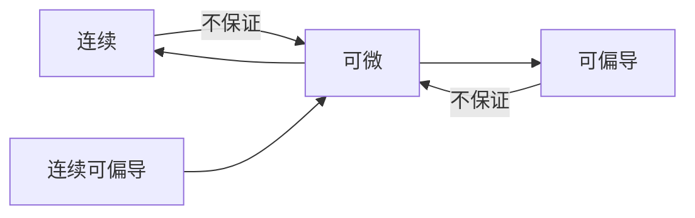

# 多元微分学及应用

## 基本概念

第一节：[多元函数的基本概念](多元微分学及应用_多元函数的基本概念.md)\
第二节：[偏导数](多元微分学及应用_偏导数.md)\
第三节：[全微分](多元微分学及应用_全微分.md)\
第四节：[多元复合函数求导法则](多元微分学及应用_多元复合函数求导法则.md)\
第五节：[隐函数求导法则](多元微分学及应用_隐函数求导法则.md)

## 多元函数微分学的应用

### 几何应用

第六节：[多元函数微分学的几何应用](多元微分学及应用_多元函数微分学的几何应用.md)\
第七节：[方向导数和梯度](多元微分学及应用_方向导数和梯度.md)

### 代数应用

第八节：[代数应用_多元函数的极值](多元微分学及应用_多元函数的极值.md)
