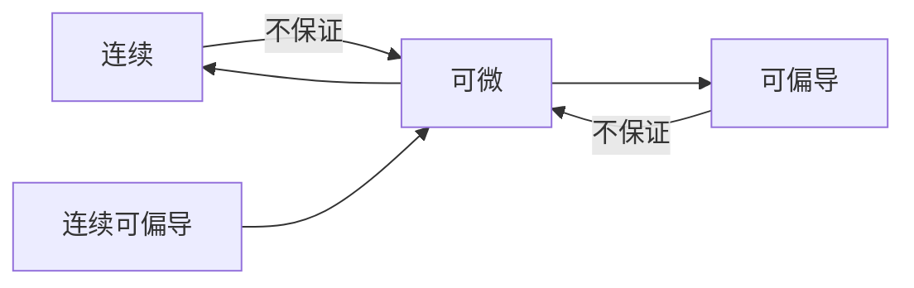

# 全微分

## 一元函数的微分

[一元函数的微分](../../高等数学一/微分方程/微分方程_Source.md#微分方程)

## 二元函数全微分

设 $z=f(x,y),((x,y)\in D),M_0(x_0,y_0)\in D$\
$\Delta z=f(x_0+\Delta x,y_0+\Delta y)-f(x_0,y_0)$ 或者可以写成 $\Delta z=f(x,y)-f(x_0,y_0)$\
将 $\Delta z$ 称为 **全增量**

如果 $\Delta z=A\Delta x+B\Delta y+\circ(\rho),\rho=\sqrt{(\Delta x)^2+(\Delta y)^2}$，称 $f(x,y)$ 在 $(x_0,y_0)$ 处 **可全微**\
其中 $A\Delta x+B\Delta y$ 称为 $f(x,y)$ 在 $(x_0,y_0)$ 处的 **全微分**\
记作 $dz|_{x_0,y_0}$ 即 $dz|_{x_0,y_0}=A\Delta x+B\Delta y$\

> 习惯上写成 $dz|_{x_0,y_0}=Adx+Bdy$

## 结论

定理一：\
$z=f(x,y),((x,y)\in D),M_0(x_0,y_0)\in D$\
若 $f(x,y)$ 在 $M_0$ 处可微，则 $f(x,y)$ 在 $(x_0,y_0)$ 连续

定理二：\
$z=f(x,y),((x,y)\in D),M_0(x_0,y_0)\in D$\
若 $f(x,y)$ 在 $M_0$ 处可微，则 $f(x,y)$ 在 $(x_0,y_0)$ 处可偏导

> $f(x,y)$ 在 $(x_0,y_0)$ 处连续 无法推导出 可微分  
> $f(x,y)$ 在 $(x_0,y_0)$ 处可偏导 无法推导出 可微分  
> 逆否命题：如果 $f(x,y)$ 在某点不可偏导，则 $f(x,y)$ 在该点不可微

判断函数在可偏导的情况下是否可微分，通关判断 $\lim_{\rho\rightarrow 0}\frac{\Delta z-A\Delta x+B\Delta y}{\rho}=0$ 是否成立

定理三(可微的充分条件)：\
若 $f(x,y)$ 的偏导数 $\frac{\partial z}{\partial x},\frac{\partial z}{\partial y}$ 连续(或者连续可偏导)，则 $f(x,y)$ 可微

| 连续、可偏导 |
|:------------:|
|     可微     |
|  连续可偏导  |

越向上，强度越弱，越向下，强度越强

$dz|_{x_0,y_0}=f_x'(x_0,y_0)dx+f_y'(x_0,y_0)dy$，则 $dz=\frac{\partial z}{\partial x}dx+\frac{\partial z}{\partial y}dy$  
