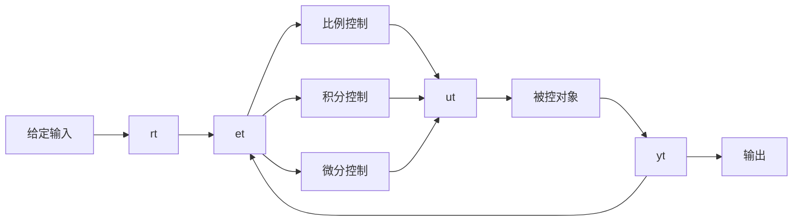

# 模拟PID控制原理
常规PID控制系统原理框图如下

et和ut为比较器

该系统由模拟PID控制器和被控对象组成。
rt是给定值
yt是系统输出值
给定值与实际输出值构成偏差et，$e(t) = r(t) - y(t)$
e(t)作为PID的控制的输入，u(t)作为PID控制器的输出和被控对象的输入
模拟PID的控制规律为
$$u(t)=K_P[e(t)+1/t\int_0^te(t)dt+T_d(de(t)/dt)]$$
+ Kp为控制器的比例系数
+ Ti为控制器的积分时间，Kp/Ti为积分系数Ki
+ Td为控制器的微分时间，Kp×Td为微分系数Kd

系数说明

+ 比例系数Kp越大，控制作用越强，则过渡过程越快，控制过程的静态偏差也就越小。但是Kp越大，也越容易产生震荡，破坏系统的稳定性
+ 积分时间Ti越大，积分的累积作用越弱，这是系统在过渡时不会产生振荡增大积分时间会减慢静态误差的消除过程，消除偏差所需的时间也比较长，但可以减少超调量，提高系统的稳定性。当Ti较小时，则积分的作用较强，这是系统的过渡时间中有可能产生震荡，不过消除偏差所需的时间较短
+ 微分时间Td越大时，则它抑制偏差e(t)变化的作用就越强;Td越小时，则它反抗偏差e(t)变化的作用越弱。微分环节的作用是组织偏差的变化，它是根据偏差的变化趋势(变化速度)进行控制的。偏差变化的越快，微分控制器的输出也就越大，并能在偏差值变大之前进行修正。但是微分的作用对输入信号的噪声很敏感，对那些噪声较大的系统一般不用微分，活在微分起作用之前对输入信号进行滤波

