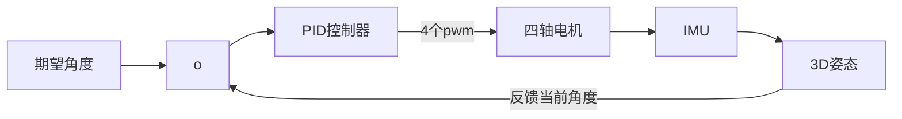

# 四轴飞行器PID控制原理
结合PID算法部分的笔记

## 简单介绍
### PID原理
对自动控制系统的基本要求
+ 稳
+ 准
+ 快

稳定性(P和I降低系统稳定性，D提高系统稳定性)：在平衡状态下，系统受到某个干扰后，经过一段时间，其控制量可以达到某一个稳定状态
准确性(P和I提高准确性，D无作用)：系统处于稳态时，其稳态误差
快速性(P和D提高响应速度，I降低响应速度)：系统对动态响应的要求，一般由过渡时间的长短来衡量

### 稳定性
当系统处于平衡状态时，受到某干扰作用后，如果系统输出能够恢复到原来的稳态值，那么系统就是稳定的，否则系统不稳定

### 动态特性(暂态特性，由于系统惯性引起的)
系统突加给定量(或者负载突然变化)时，系统输出的动态响应曲线、延迟时间、上升时间、峰值时间、调节时间、超调量和震荡次数

### 稳态特性
在参考信号输出下，经过无穷时间，其系统输出与参考信号的误差。
影响因素：
+ 系统结构
+ 参数
+ 输出量的形式

### 比例控制规律
具有P控制的系统，其稳态误差可以通过P控制器的增益$K_p$来调整
$K_p$越大，其系统稳定性会降低
由$m(t)=K_pe(t)$可知，控制器的输出$m(t)$与输入误差信号$e(t)$成比例关系，偏差减小的速度取决于比例系数$K_p$
$K_p$越大，偏差减小越快，但是容易引起系统的震荡`尤其在向前通道中存在比较大的时滞环节时`
$K_p$减小，发生震荡的可能性较小，但是调节速度变慢
**单纯的P可哦拿之无法消除稳态误差，需要引入积分I的控制**
$$\lim_{t\to\infty}e(t)=R/K_v$$

当参考输入信号R不为0时，去稳态误差只能趋近于0,不能等于0

### 比例积分控制规律
可以反应输入信号的变化趋势，具有某种预见性，可谓系统引进一个有效的早期修正信号，以增加系统的阻尼程度，从而提高系统的稳定性
$$m(t)=K_pe(t)+K_P\tau (de(t)/dt)$$

如果系统中存在较大时滞环节，则输出变化重视落后于当前误差的变化，解决的办法就是使抑制误差的作用变化"超前"，增强系统的稳定性

### 积分I控制规律
由于采用了积分环节，若当前误差e(t)为0，则其输出信号m(t)有可能是一个不为0的常量。需要注意的是，引入积分环节，可以提到系统型别，使得系统可以跟踪更高阶次的输入信号，以消除稳态误差。
$$m(t)=K_I\int_0^te(t)dt$$

### 比例积分控制规律
在保证系统稳定的前提下，引入PI控制器可以提高它的稳态控制质量，消除其稳态误差
$$m(t)=K_p*e(t)+K_P/T_I\int_0^te(t)dt$$


### 比例积分微分控制规律
除了积分环节提高了系统型别，微分环节提高了系统的动态性能。
$$m(t)=K_pe(t)+K_p/T_i\int_0^te(t)dt+K_p\tau(de(t)/dt)$$

## 控制影响
### P控制对系统性能的影响
+ 开环增益越大，稳态误差越小`无法消除，属于有差调节`
+ 过渡时间缩短
+ 稳定程序变差

### I控制对系统性能的影响
+ 消除稳态误差`能够消除稳态误差，属于无差调节`
+ 稳定程序变差

### D控制对系统性能影响
+ 减小超调量
+ 减小调节时间`与单纯的P控制相比较`
+ 增强系统的稳定性
+ 增加系统的阻尼程度

### PD对系统性能影响
+ 减小调节时间
+ 减小超调量
+ 增大阻尼系数，增强系统稳定性
+ 增加高频干扰

### PI控制对系统性能的影响
+ 提高系统型别，减小系统稳态误差
+ 增强系统抗高频干扰能力
+ 调节时间增大

### 位置式PID(数字PID)
$$P(n)=K_p[e(n)+(T_s/T_I)\sum_{i=0}^ne(i)+(T_D/T_s)(e(n)-e(n-1))]$$

### 消除干扰的措施
+ 几个采样时刻的采样值求平均后代替本次的采样值
+ 微分项的四点中心差分$e(n)-e(n-3)+3e(n-1)-3e(n-2)*1/(6Ts)$
+ 矩形积分改为梯形积分$\sum_{i=0}^ne(i)\to\sum_{i=0}^n[e(i)+e(i-1)]/2$

## PID调试一般原则
+ 在输出不震荡时增大比例系数P
+ 在输出不震荡时(能消除静态误差就行)，减小积分时间常数$T_i$
+ 在输出不震荡时，增大微分时间常数$T_D$

## 常用的四轴的两种PID算法
### 单环PID

PID内容

|      值      |                 描述                 |
|:------------:|:------------------------------------:|
| 当前角度误差 |          期望角度-当前角度           |
| 单环PID_P项  |          $K_p×$当前角度误差          |
| 单环PID_I项  |        $K_I×$当前角度误差积分        |
| 单环PID_D项  | $K_d×$当前角度的微分(直接用陀螺仪测) |
| 单环PID输出  |    单环PID_P+单环PID_I+单环PID_D     |

实际上场次角度的微分就是角速度，可以由陀螺仪给出

单环PID控制算法仅仅考虑了飞行器的角度信息，如果想增加飞行器的稳定性(增加阻尼)并提高它的控制品质
可以进一步的控制它的角速度，于是角度/角速度-串级PID控制算法应运而生

```mermaid
 graph LR;
	期望角度--> o -->PID角度环控制器--期望角速度--> 角速度环PID控制器-->四轴电机-->IMU-->3D姿态
	IMU-->角速度环PID控制器
	3D姿态--反馈当前角度---->o
 ```
 
|       值       |                   描述                   |
|:--------------:|:----------------------------------------:|
|  当前角度误差  |            期望角度-当前角度             |
|  外环PID_P项   |          外环$K_P×$当前角度误差          |
|  外环PID_I项   |        外环$K_I×$当前角度误差积分        |
|  外环PID_输出  |         外环PID_P项+外环PID_I项          |
| 当前角速度误差 | 外环PID_输出 -当前加速度(直接用陀螺仪测) |
|  内环PID_P项   |         内环$K_P×$当前角速度误差         |
|  内环PID_I项   |       内环$K_I×$当前角速度误差积分       |
|  内环PID_D项   |        内环$K_D×$当前角速度的微分        |
|  内环PID_输出  |      内环PID_P+内环PID_I+内环PID_D       |


