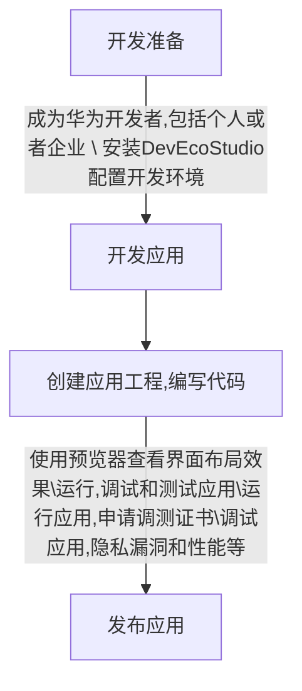

# 开发流程

## 鸿蒙开发所使用的语言
有三种语言可以选择，分别时`Java`、Js、C/C++
鸿蒙应用开发，使用的还是Java
鸿蒙设备开发使用的是C/C++

## 开发工具项目结构
+ .gradle：项目管理工具
+ .idea：开发工具的信息
+ entry：应用主模块

### entry
+ libs：如果需要手动倒入第三方的jar包，就要倒入到libs里面
+ src：写的所有代码
	+ main：最主要的部分
		+ java：自己写的java代码
		+ resource：项目所需要的所有资源，图片、音视频等
		+ config.json：app的配置信息，版本、公司、权限等
	+ ohosTest：用华为工具编写的测试工具
	+ test：junit测试的类

