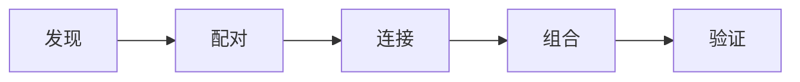

# 鸿蒙系统介绍
## 鸿蒙的官方对比
面向全场景、面向未来的操作系统
华为终端与各个设备之间通过`软总线`连接

## 鸿蒙特点
+ 统一OS，弹性部署
+ 硬件互助，资源共享
	+ 系统层让终端融为一体，成为超级终端

+ 一次开发，多端部署
+ 应用自由跨端
+ 简单激活设备智能

## 鸿蒙和安卓不同
### 系统内核方面
安卓系统是基于Linux宏内核设计，包含了操作系统绝大多数的功能和模块，并且这些模块有最高的权限，只要一个模块出错，整个系统就会崩溃
鸿蒙操作系统是基于微内核设计的，微内核金包含了操作系统必要的功能模块(任务管理、内存分配等)，必要的模块处在核心地位，具有较高的权限，其他模块布局有最高权限，也就是其他模块出问题，对整个系统的运行是没有阻碍的。微内核的稳定性很高。
**鸿蒙系统包含了两个内核**:
+ Linux内核，手机操作系统的内核
+ LiteOS内核，智能硬件的内核
	+ 轻量级(内核小于10K)
	+ 低功耗

### 运行速度
安卓系统不能与系统底层直接进行通信活动，是运行在虚拟机上的，如果虚拟机出现问题，系统就会卡住
鸿蒙系统中的`方舟编译器`解决了这个问题，它会把代码直接编译成机器识别的机器码，直接运行在操作系统中，可以直接与系统底层进行通信
大约会快60%

### 作为手机操作系统的对比
安卓和鸿蒙都是基于安卓开源项目(`AOSP`)进行开发的，`AOSP`是全球程序员共同维护和开发的，谷歌和华为也是其中的提供者之一
任何人都可以在开源许可下自由使用和更改
很多手机厂商都是基于AOSP设计了自己的操作系统

HarmonyOS = AOSP-GMS-安卓UI
另外添加了HMS、鸿蒙UI、**分布式软总线**、以ability为核心的应用开发框架等其他各种华为研发的内容

### 连接其他设备
**安卓系统：**
不管从app开发，还有使用方面都比较麻烦

**鸿蒙OS**
从app开发方面，只要写很少的代码就可以调用第三方硬件
从使用角度来讲，不管多少设备连接在一起，鸿蒙的终极目标都是能像使用一个设备那样简单

