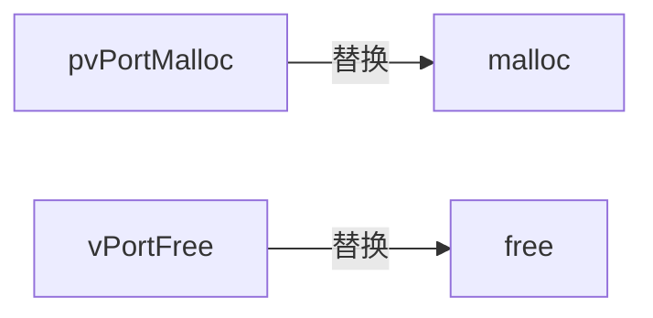

# FreeRTOS内存管理
内存管理是一个系统基本组成部分，FreeRTOS 中大量使用到了内存管理，比如创建任务、信号量、队列等会自动从堆中申请内存。

## FreeRTOS内存管理
FreeRTOS 创建任务、队列、信号量等的时候有两种方法，一种是动态的申请所需的 RAM。一种是由用户自行定义所需的 RAM，这种方法也叫静态方法，使用静态方法的函数一般以“Static”结尾，比如任务创建函数 xTaskCreateStatic()，使用此函数创建任务的时候需要由用户定义任务堆栈。

使用动态内存管理的时候 FreeRTOS 内核在创建任务、队列、信号量的时候会动态的申请RAM。标准 C 库中的 malloc()和 free()也可以实现动态内存管理，但是如下原因限制了其使用：
+ 在小型的嵌入式系统中效率不高
+ 会占用很多的代码空间。
+ 它们不是线程安全的
+ 具有不确定性，每次执行的时间不同。
+ 会导致内存碎片
+ 使链接器的配置变得复杂

不同的嵌入式系统对于内存分配和时间要求不同，因此一个内存分配算法可以作为系统的可选选项。FreeRTOS 将内存分配作为移植层的一部分，这样 FreeRTOS 使用者就可以使用自己的合适的内存分配方法。

当内核需要 RAM 的时候可以使用 `pvPortMalloc()`来替代`malloc()`申请内存，不使用内存的时候可以使用 `vPortFree()` 函数来替代 `free()` 函数释放内存。函数 `pvPortMalloc()` 、`vPortFree()` 与函数 `malloc()`、`free()` 的函数原型类似。


FreeRTOS提供5种内存分配方法，reeRTOS 使用者可以其中的某一个方法，或者自己的内存分配方法。
这 5 种方法是 5 个文件
+ heap_1.c
+ heap_2.c
+ heap_3.c
+ heap_4.c
+ heap_5.c

这5个文件在FreeRTOS源码中

## 内存碎片
内存碎片是伴随着内存申请和释放而来的
![[Pasted image 20210718184513.png]]
分配内存与释放内存不协调，导致内存碎片

## heap_1内存分配方法
动态内存分配需要一个内存堆，FreeRTOS中的内存堆为 `ucHeap[]`，大小为`configTOTAL_HEAP_SIZE`，这个前面讲 FreeRTOS 配置的时候就讲过了。不管是哪种内存分配方法，它们的内存堆都为 `ucHeap[]`,而且大小都是 `configTOTAL_HEAP_SIZE`。
```c
#if( configAPPLICATION_ALLOCATED_HEAP == 1 )
	extern uint8_t ucHeap[ configTOTAL_HEAP_SIZE ]; //需要用户自行定义内存堆
#else  
	static uint8_t ucHeap[ configTOTAL_HEAP_SIZE ]; //编译器决定  
#endif
```
当宏 `configAPPLICATION_ALLOCATED_HEAP` 为 1 的时候需要用户自行定义内存堆，否则的话由编译器来决定，默认都是由编译器来决定的。
如果自己定义的话就可以将内存堆定义到外部 SRAM 或者 SDRAM 中。

### heap_1特性
+ 适用于那些一旦创建好任务、信号量和队列就再也不会删除的应用
+ 具有可确定性(执行所花费的时间大多数都是一样的)，而且不会导致内存碎片
+ 代码实现和内存分配过程都非常简单，内存是从一个静态数组中分配到的，也就是适合于那些不需要动态内存分配的应用

### 内存申请函数
heap_1 的内存申请函数 `pvPortMalloc()`
```c
void *pvPortMalloc( size_t xWantedSize ){
	void *pvReturn = NULL;  
	static uint8_t *pucAlignedHeap = NULL;

	//确保字节对齐
	#if( portBYTE_ALIGNMENT != 1 )
	{
		if( xWantedSize & portBYTE_ALIGNMENT_MASK ) (2)  
		{  
			//需要进行字节对齐  
			xWantedSize += ( portBYTE_ALIGNMENT - ( xWantedSize & portBYTE_ALIGNMENT_MASK ) );  
		}
	}
	#endif
	
	vTaskSuspendAll();
	{
		if( pucAlignedHeap == NULL )
		{
			//确保内存堆的开始地址是字节对齐的
			pucAlignedHeap = ( uint8_t * ) ( ( ( 			portPOINTER_SIZE_TYPE )\
								&ucHeap[ portBYTE_ALIGNMENT ] ) &\  
								( ~( ( portPOINTER_SIZE_TYPE )\  
								portBYTE_ALIGNMENT_MASK ) ) );
		}
		// 检查是否有足够的内存供分配，有的话就分配内存
		if( ( ( xNextFreeByte + xWantedSize ) < configADJUSTED_HEAP_SIZE ) && ( ( xNextFreeByte + xWantedSize ) > xNextFreeByte ) )
		{
			pvReturn = pucAlignedHeap + xNextFreeByte;
			xNextFreeByte += xWantedSize;
		}
		traceMALLOC( pvReturn, xWantedSize );
	}
	( void ) xTaskResumeAll();
	
	#if( configUSE_MALLOC_FAILED_HOOK == 1 )
	{
		if( pvReturn == NULL )
		{
			extern void vApplicationMallocFailedHook( void );  
			vApplicationMallocFailedHook();
		}
	}
	#endif
	
	return pvReurn;
}
```

### 内存释放
heap_1 的内存释放函数为 pvFree()
```c
void vPortFree( void *pv )  
{  
	( void ) pv;  
	configASSERT( pv == NULL );  
}
```
可以看出 vPortFree()并没有具体释放内存的过程。因此如果使用 heap_1，一旦申请内存成功就不允许释放

## heap_2内存分配方法
heap_2提供了一个更好的分配算法，不像heap_1那样，heap_2提供了内存释放函数不会把释放的内存块合并成一个大块，这样有一个缺点，随着你不断的申请内存，内存堆就会被分为很多个大小不一的内存(块)，也就是会导致内存碎片
### heap_2特性
可以使用在那些可能会重复的删除任务、队列、信号量等的应用中，要注意有内存碎片产生如果分配和释放的内存 n 大小是随机的，那么就要慎重使用了
+ 如果一个应用动态的创建和删除任务，而且任务需要分配的堆栈大小都是一样的，那么 `heap_2` 就非常合适
+ 如果任务所需的堆栈大小每次都是不同，那么 `heap_2` 就不适合了，因为这样会导致内存碎片产生，最终导致任务分配不到合适的堆栈。
+ 如果一个应用中所使用的队列存储区域每次都不同，那么 heap_2 就不适合了，和上面一样，此时可以使用 `heap_4`
+ 应用需要调用 `pvPortMalloc()` 和 `vPortFree()` 来申请和释放内存，而不是通过其他FreeRTOS 的其他 API 函数来间接的调用，这种情况下 `heap_2` 不适合。

如果应用中的任务、队列、信号量和互斥信号量具有不可预料性(如所需的内存大小不能确定，每次所需的内存都不相同，或者说大多数情况下所需的内存都是不同的)的话可能会导致内存碎片，虽然是小概率事件，的那时还是要引起注意。
具有不可确定性，但是也远比标准 C 中的 `mallo()` 和 `free()` 效率高

### 内存块
heap_1 一样，heap_2 整个内存堆为 `ucHeap[]`，大小为 `configTOTAL_HEAP_SIZE`。可以通过函数 `xPortGetFreeHeapSize()` 来获取剩余的内存大小
为了实现内存释放，heap_2 引入了内存块的概念，每分出去的一段内存就是一个内存块，剩下的空闲内存也是一个内存块，内存块大小不定。
为了管理内存块引入了一个链表结构
```c
typedef struct A_BLOCK_LINK
{
	struct A_BLOCK_LINK *pxNextFreeBlock; //指向链表中下一个空闲内存块
	size_t xBlockSize; 					  //当前空闲内存块大小
}BlockLink_t;
```
每个内存块前面都会有一个 BlockLink_t 类型的变量来描述此内存块

| 内存块          |
| --------------- |
| pxNextFreeBlock |
| xBlockSize=24   |
| 16字节          |

内存块的总大小为24字节，虽然只申请了16字节，但是还需要另外8字节来保存 `BlockLink_t` 类型的结构体变量，xBlockSize记录的是整个内存块的大小。
为了方便管理，可用的内存块会被全部组织在一个链表内，局部静态变量 `xStart`, `xEnd` 用来记录这个链表的头和尾
```c
static BlockLink_t xStart, xEnd;
```

### 内存堆初始化函数
内存堆初始化函数为 `prvHeapInit()` 
```c
static void prvHeapInit( void )
{
	BlockLink_t *pxFirstFreeBlock;  
	uint8_t *pucAlignedHeap;
	
	// 确保内存堆的开始地址是字节对齐的
	pucAlignedHeap = ( uint8_t * ) ( ( ( portPOINTER_SIZE_TYPE )\ 
									&ucHeap[ portBYTE_ALIGNMENT ] ) & \  
									( ~( ( portPOINTER_SIZE_TYPE )\  
									portBYTE_ALIGNMENT_MASK ) ) );
	//xStart 指向空闲内存块链表首。  
	xStart.pxNextFreeBlock = ( void * ) pucAlignedHeap; 
	xStart.xBlockSize = ( size_t ) 0;
	
	//xEnd 指向空闲内存块链表尾。  
	xEnd.xBlockSize = configADJUSTED_HEAP_SIZE; 
	xEnd.pxNextFreeBlock = NULL;
	
	//刚开始只有一个空闲内存块，空闲内存块的总大小就是可用的内存堆大小。  
	pxFirstFreeBlock = ( void * ) pucAlignedHeap; 
	pxFirstFreeBlock->xBlockSize = configADJUSTED_HEAP_SIZE;  
	pxFirstFreeBlock->pxNextFreeBlock = &xEnd;
}
```

每个内存块前面都会保存一个 BlockLink_t 类型的结构体变量，这个结构体变量用来描述此内存块的大小和下一个空闲内存块的地址。


### 内存插入函数
heap_2允许内存释放，释放的内存肯定是要添加到空闲内存链表中的，宏
`prvInsertBlockIntoFreeList()`用来完成内存块的插入操作
宏定义如下：
```c
#define prvInsertBlockIntoFreeList( pxBlockToInsert)
{
	BlockLink_t *pxIterator;   
	size_t xBlockSize;  
  
	xBlockSize = pxBlockToInsert->xBlockSize;
	
	// 遍历链表，查找插入点
	for( pxIterator = &xStart; pxIterator->pxNextFreeBlock->xBlockSize < xBlockSize;pxIterator = pxIterator->pxNextFreeBlock )
	{
		// 不做任何事情
	}
	//将内存块插入到插入点   
	pxBlockToInsert->pxNextFreeBlock = pxIterator->pxNextFreeBlock;
	pxIterator->pxNextFreeBlock = pxBlockToInsert;
}
```
寻找内存块的插入点，内存块是按照内存大小从小到大连接起来的，因为只是用来寻找插入点的，所以 for 循环体内没有任何代码
找到内存插入点以后就将内存块插入到链表中

### 内存申请
```c
void * pvPortMalloc( size_t xWantedSize )
{
    BlockLink_t * pxBlock, * pxPreviousBlock, * pxNewBlockLink;
    static BaseType_t xHeapHasBeenInitialised = pdFALSE;
    void * pvReturn = NULL;

    vTaskSuspendAll();
    {	
		// 如果第一次申请内存的话需要初始化内存堆
        if( xHeapHasBeenInitialised == pdFALSE )
        {
            prvHeapInit();
            xHeapHasBeenInitialised = pdTRUE;
        }
		// 内存大小字节对齐，实际申请的内存大小还要加上结构体
		// BlockLink_t 的大小
        if( ( xWantedSize > 0 ) && 
            ( ( xWantedSize + heapSTRUCT_SIZE ) >  xWantedSize ) ) 
        {
            xWantedSize += heapSTRUCT_SIZE;
			
			//xWantedSize 做字节对齐处理
            if( ( xWantedSize + ( portBYTE_ALIGNMENT - ( xWantedSize & portBYTE_ALIGNMENT_MASK ) ) ) 
                    > xWantedSize )
            {
                xWantedSize += ( portBYTE_ALIGNMENT - ( xWantedSize & portBYTE_ALIGNMENT_MASK ) );
                configASSERT( ( xWantedSize & portBYTE_ALIGNMENT_MASK ) == 0 );
            }
            else
            {
                xWantedSize = 0;
            }       
        }
        else 
        {
            xWantedSize = 0; 
        }

		// 所申请的内存大小合理，进行内存分配
        if( ( xWantedSize > 0 ) && ( xWantedSize <= xFreeBytesRemaining ) )
        {
			//从 xStart(最小内存块)开始，查找大小满足所需要内存的内存块
            pxPreviousBlock = &xStart;
            pxBlock = xStart.pxNextFreeBlock;

            while( ( pxBlock->xBlockSize < xWantedSize ) && ( pxBlock->pxNextFreeBlock != NULL ) )
            {
                pxPreviousBlock = pxBlock;
                pxBlock = pxBlock->pxNextFreeBlock;
            }

            if( pxBlock != &xEnd )
            {
				//返回申请到的内存首地址
                pvReturn = ( void * ) ( ( ( uint8_t * ) pxPreviousBlock->pxNextFreeBlock ) + heapSTRUCT_SIZE );

                pxPreviousBlock->pxNextFreeBlock = pxBlock->pxNextFreeBlock;

                if( ( pxBlock->xBlockSize - xWantedSize ) > heapMINIMUM_BLOCK_SIZE )
                {
                    /* This block is to be split into two.  Create a new block
                     * following the number of bytes requested. The void cast is
                     * used to prevent byte alignment warnings from the compiler. */
                    pxNewBlockLink = ( void * ) ( ( ( uint8_t * ) pxBlock ) + xWantedSize );

                                        pxNewBlockLink->xBlockSize = pxBlock->xBlockSize - xWantedSize;
                    pxBlock->xBlockSize = xWantedSize;
					
                    prvInsertBlockIntoFreeList( ( pxNewBlockLink ) );
                }

                xFreeBytesRemaining -= pxBlock->xBlockSize;
            }
        }

        traceMALLOC( pvReturn, xWantedSize );
    }
    ( void ) xTaskResumeAll();

    #if ( configUSE_MALLOC_FAILED_HOOK == 1 )
        {
            if( pvReturn == NULL )
            {
                extern void vApplicationMallocFailedHook( void );
                vApplicationMallocFailedHook();
            }
        }
    #endif

    return pvReturn;
}
```

### 内存释放函数
```c
void vPortFree( void * pv )
{
    uint8_t * puc = ( uint8_t * ) pv;
    BlockLink_t * pxLink;

    if( pv != NULL )
    {
        puc -= heapSTRUCT_SIZE;
		
        pxLink = ( void * ) puc;

        vTaskSuspendAll();
        {
			// 将内存块添加到空闲内存块链表中
            prvInsertBlockIntoFreeList( ( ( BlockLink_t * ) pxLink ) );
            xFreeBytesRemaining += pxLink->xBlockSize;
            traceFREE( pv, pxLink->xBlockSize );
        }
        ( void ) xTaskResumeAll();
    }
}
```

## heap_3 内存分配方法
这个分配方法是对标准 C 中的函数 malloc()和 free()的简单封装

### heap_3特性
需要编译器提供一个内存堆，编译器库要提供 malloc()和 free()函数。比如使用 STM32 的话可以通过修改启动文件中的 Heap_Size 来修改内存堆的大小。
![[Pasted image 20210718202835.png]]
+ 具有不确定性
+ 可能会增加代码量。

在heap3中 `configTOTAL_HEAP_SIZE` 是没用的

### 内存申请函数
```c
void *pvPortMalloc( size_t xWantedSize )
{
	void *pvReturn;
	vTaskSuspendAll(); 
	{  
		pvReturn = malloc( xWantedSize;
		traceMALLOC( pvReturn, xWantedSize );  
	}
	( void ) xTaskResumeAll();
	#if( configUSE_MALLOC_FAILED_HOOK == 1 )
	{
		if( pvReturn == NULL )
		{
			extern void vApplicationMallocFailedHook( void );  
			vApplicationMallocFailedHook();
		}
	}
	#endif
	
	reuturn pvReturn;
}
```

### 内存释放函数
```c
void vPortFree( void *pv )
{
	if( pv )  
	{  
		vTaskSuspendAll(); 
		{  
			free( pv ); 
			traceFREE( pv, 0 );  
		}  
		( void ) xTaskResumeAll(); (6)  
	}
}
```


## heap_4内存分配方法
heap_4 提供了一个最优的匹配算法，不像 heap_2，heap_4 会将内存碎片合并成一个大的可  
用内存块，它提供了内存块合并算法。内存堆为 `ucHeap[]`，大小同样为 `configTOTAL_HEAP_SIZE`。可以通过函数 `xPortGetFreeHeapSize()`来获取剩余的内存大小。

### heap_4特性
+ 可以用在那些需要重复创建和删除任务、队列、信号量和互斥信号量等的应用中。
+ 不会像 heap_2 那样产生严重的内存碎片，即使分配的内存大小是随机的
+ 具有不确定性，但是远比 C 标准库中的 malloc()和 free()效率高。
+ heap_4 非常适合于那些需要直接调用函数 pvPortMalloc()和 vPortFree()来申请和释放内存的应用
+ heap_4 也使用链表结构来管理空闲内存块，链表结构体与 heap_2 一样。heap_4 也定义了两个局部静态变量 `xStart` 和 `pxEnd` 来表示链表头和尾，其中 `pxEnd` 是指向 `BlockLink_t` 的指针。

### 内存初始化函数
```c
static void prvHeapInit( void )
{
	BlockLink_t *pxFirstFreeBlock;  
	uint8_t *pucAlignedHeap;  
	size_t uxAddress;  
	size_t xTotalHeapSize = configTOTAL_HEAP_SIZE;
	
	// 起始地址做字节对齐处理
	uxAddress = ( size_t ) ucHeap;
	if( ( uxAddress & portBYTE_ALIGNMENT_MASK ) != 0 ) 
	{  
		uxAddress += ( portBYTE_ALIGNMENT - 1 );
		uxAddress &= ~( ( size_t ) portBYTE_ALIGNMENT_MASK );
		xTotalHeapSize -= uxAddress - ( size_t ) ucHeap;
	}
	
	pucAlignedHeap = ( uint8_t * ) uxAddress;
	
	//xStart 为空闲链表头。  
	xStart.pxNextFreeBlock = ( void * ) pucAlignedHeap;
	xStart.xBlockSize = ( size_t ) 0;
	
	//pxEnd 为空闲内存块列表尾，并且将其放到到内存堆的末尾  
	uxAddress = ( ( size_t ) pucAlignedHeap ) + xTotalHeapSize;
	uxAddress -= xHeapStructSize;  
	uxAddress &= ~( ( size_t ) portBYTE_ALIGNMENT_MASK );  
	pxEnd = ( void * ) uxAddress;  
	pxEnd->xBlockSize = 0;  
	pxEnd->pxNextFreeBlock = NULL;
	
	//开始的时候将内存堆整个可用空间看成一个空闲内存块。  
	pxFirstFreeBlock = ( void * ) pucAlignedHeap; 
	pxFirstFreeBlock->xBlockSize = uxAddress - ( size_t ) 	pxFirstFreeBlock;  
	pxFirstFreeBlock->pxNextFreeBlock = pxEnd;
	
	//只有一个内存块，而且这个内存块拥有内存堆的整个可用空间  
	xMinimumEverFreeBytesRemaining = pxFirstFreeBlock->xBlockSize;
	xFreeBytesRemaining = pxFirstFreeBlock->xBlockSize;
	
	xBlockAllocatedBit = ( ( size_t ) 1 ) << ( ( sizeof( size_t ) * heapBITS_PER_BYTE ) - 1 );
	
}
```
初始化之后的内存堆
![[Pasted image 20210718203837.png]]

### 内存块插入函数
内存块插入函数 prvInsertBlockIntoFreeList()用来将某个内存块插入到空闲内存块链表
```c
static void prvInsertBlockIntoFreeList( BlockLink_t * pxBlockToInsert ) /* PRIVILEGED_FUNCTION */
{
    BlockLink_t * pxIterator;
    uint8_t * puc;

    for( pxIterator = &xStart; pxIterator->pxNextFreeBlock < pxBlockToInsert; pxIterator = pxIterator->pxNextFreeBlock )
    {
       // 不做任何处理
    }
	// 插入内存块，如果要插入的内存块可以和前一个内存块合并的话就  
	// 合并两个内存块
    puc = ( uint8_t * ) pxIterator;

    if( ( puc + pxIterator->xBlockSize ) == ( uint8_t * ) pxBlockToInsert )
    {
        pxIterator->xBlockSize += pxBlockToInsert->xBlockSize;
        pxBlockToInsert = pxIterator;
    }
    else
    {
        mtCOVERAGE_TEST_MARKER();
    }
	
	// 检查是否可以和后面的内存块合并，可以的话就合并
    puc = ( uint8_t * ) pxBlockToInsert;

    if( ( puc + pxBlockToInsert->xBlockSize ) == ( uint8_t * ) pxIterator->pxNextFreeBlock )
    {
        if( pxIterator->pxNextFreeBlock != pxEnd )
        {
			// 将两个内存块组合成一个大的内存块
            pxBlockToInsert->xBlockSize += pxIterator->pxNextFreeBlock->xBlockSize;
            pxBlockToInsert->pxNextFreeBlock = pxIterator->pxNextFreeBlock->pxNextFreeBlock;
        }
        else
        {
            pxBlockToInsert->pxNextFreeBlock = pxEnd;
        }
    }
    else
    {
        pxBlockToInsert->pxNextFreeBlock = pxIterator->pxNextFreeBlock;
    }

    if( pxIterator != pxBlockToInsert )
    {
        pxIterator->pxNextFreeBlock = pxBlockToInsert;
    }
    else
    {
        mtCOVERAGE_TEST_MARKER();
    }
}
```
![[Pasted image 20210718204343.png]]
椭圆圈起来的就是要插入的内存块，其起始地址为 0x20009040
该地址刚好和内存块 Block2 的末地址一样，所以这两个内存块可以合并在一起
![[Pasted image 20210718204444.png]]、

### 内存申请函数
```c
void * pvPortMalloc( size_t xWantedSize )
{
    BlockLink_t * pxBlock, * pxPreviousBlock, * pxNewBlockLink;
    void * pvReturn = NULL;

    vTaskSuspendAll();
    {
        
		// 第一次调用，初始化内存堆
        if( pxEnd == NULL )
        {
            prvHeapInit();
        }
        else
        {
            mtCOVERAGE_TEST_MARKER();
        }

        //需要申请的内存块大小的最高位不能为 1，因为最高位用来表示内存块有没有  
		//被使用
        if( ( xWantedSize & xBlockAllocatedBit ) == 0 )
        {
            
            if( ( xWantedSize > 0 ) && 
                ( ( xWantedSize + xHeapStructSize ) >  xWantedSize ) ) /* Overflow check */
            {
                xWantedSize += xHeapStructSize;

                if( ( xWantedSize & portBYTE_ALIGNMENT_MASK ) != 0x00 )
                {
                    
                    if( ( xWantedSize + ( portBYTE_ALIGNMENT - ( xWantedSize & portBYTE_ALIGNMENT_MASK ) ) ) 
                            > xWantedSize )
                    {
                        xWantedSize += ( portBYTE_ALIGNMENT - ( xWantedSize & portBYTE_ALIGNMENT_MASK ) );
                        configASSERT( ( xWantedSize & portBYTE_ALIGNMENT_MASK ) == 0 );
                    }
                    else
                    {
                        xWantedSize = 0;
                    }  
                }
                else
                {
                    mtCOVERAGE_TEST_MARKER();
                }
            } 
            else 
            {
                xWantedSize = 0;
            }

            if( ( xWantedSize > 0 ) && ( xWantedSize <= xFreeBytesRemaining ) )
            {
				//从 xStart(内存块最小)开始，查找大小满足所需要内存的内存块
                pxPreviousBlock = &xStart;
                pxBlock = xStart.pxNextFreeBlock;

                while( ( pxBlock->xBlockSize < xWantedSize ) && ( pxBlock->pxNextFreeBlock != NULL ) )
                {
                    pxPreviousBlock = pxBlock;
                    pxBlock = pxBlock->pxNextFreeBlock;
                }

                // 如果找到的内存块是 pxEnd 的话就表示没有内存可以分配
                if( pxBlock != pxEnd )
                {
                   
                    pvReturn = ( void * ) ( ( ( uint8_t * ) pxPreviousBlock->pxNextFreeBlock ) + xHeapStructSize );
					// 将申请到的内存块从空闲内存链表中移除
                    pxPreviousBlock->pxNextFreeBlock = pxBlock->pxNextFreeBlock;
					
					//如果申请到的内存块大于所需的内存，就将其分成两块
                    if( ( pxBlock->xBlockSize - xWantedSize ) > heapMINIMUM_BLOCK_SIZE )
                    {
                                             pxNewBlockLink = ( void * ) ( ( ( uint8_t * ) pxBlock ) + xWantedSize );
                        configASSERT( ( ( ( size_t ) pxNewBlockLink ) & portBYTE_ALIGNMENT_MASK ) == 0 );

                        pxNewBlockLink->xBlockSize = pxBlock->xBlockSize - xWantedSize;
                        pxBlock->xBlockSize = xWantedSize;

                        /* Insert the new block into the list of free blocks. */
                        prvInsertBlockIntoFreeList( pxNewBlockLink );
                    }
                    else
                    {
                        mtCOVERAGE_TEST_MARKER();
                    }

                    xFreeBytesRemaining -= pxBlock->xBlockSize;

                    if( xFreeBytesRemaining < xMinimumEverFreeBytesRemaining )
                    {
                        xMinimumEverFreeBytesRemaining = xFreeBytesRemaining;
                    }
                    else
                    {
                        mtCOVERAGE_TEST_MARKER();
                    }
					
					//内存块申请成功
                    pxBlock->xBlockSize |= xBlockAllocatedBit;
                    pxBlock->pxNextFreeBlock = NULL;
                    xNumberOfSuccessfulAllocations++;
                }
                else
                {
                    mtCOVERAGE_TEST_MARKER();
                }
            }
            else
            {
                mtCOVERAGE_TEST_MARKER();
            }
        }
        else
        {
            mtCOVERAGE_TEST_MARKER();
        }

        traceMALLOC( pvReturn, xWantedSize );
    }
    ( void ) xTaskResumeAll();

    #if ( configUSE_MALLOC_FAILED_HOOK == 1 )
        {
            if( pvReturn == NULL )
            {
				//调用钩子函数
                extern void vApplicationMallocFailedHook( void );
                vApplicationMallocFailedHook();
            }
            else
            {
                mtCOVERAGE_TEST_MARKER();
            }
        }
    #endif /* if ( configUSE_MALLOC_FAILED_HOOK == 1 ) */

    configASSERT( ( ( ( size_t ) pvReturn ) & ( size_t ) portBYTE_ALIGNMENT_MASK ) == 0 );
    return pvReturn;
}

```

### 内存释放函数
```c
void vPortFree( void * pv )
{
    uint8_t * puc = ( uint8_t * ) pv;
    BlockLink_t * pxLink;

    if( pv != NULL )
    {
        puc -= xHeapStructSize;
		
		// 防止编译器报错
        pxLink = ( void * ) puc;

        configASSERT( ( pxLink->xBlockSize & xBlockAllocatedBit ) != 0 );
        configASSERT( pxLink->pxNextFreeBlock == NULL );

        if( ( pxLink->xBlockSize & xBlockAllocatedBit ) != 0 )
        {
            if( pxLink->pxNextFreeBlock == NULL )
            {
                pxLink->xBlockSize &= ~xBlockAllocatedBit;

                vTaskSuspendAll();
                {
                    xFreeBytesRemaining += pxLink->xBlockSize;
                    traceFREE( pv, pxLink->xBlockSize );
                    prvInsertBlockIntoFreeList( ( ( BlockLink_t * ) pxLink ) );
                    xNumberOfSuccessfulFrees++;
                }
                ( void ) xTaskResumeAll();
            }
            else
            {
                mtCOVERAGE_TEST_MARKER();
            }
        }
        else
        {
            mtCOVERAGE_TEST_MARKER();
        }
    }

```

## heap_5内存分配
heap_5 使用了和 heap_4 相同的合并算法，内存管理实现起来基本相同，但是 heap_5 允许内存堆跨越多个不连续的内存段。比如 STM32 的内部 RAM 可以作为内存堆，但是 STM32 内部 RAM 比较小，遇到那些需要大容量 RAM 的应用就不行了，如音视频处理。不过 STM32 可以外接 SRAM 甚至大容量的 SDRAM，如果使用 heap_4 的话你就只能在内部 RAM 和外部SRAM 或 SDRAM 之间二选一了，使用 heap_5 的话就不存在这个问题，两个都可以一起作为内存堆来用。

如果使用 heap_5 的话，在调用 API 函数之前需要先调用函数 `vPortDefineHeapRegions()`来对内存堆做初始化处理，在 `vPortDefineHeapRegions()`未执行完之前禁止调用任何可能会调用`pvPortMalloc()` 的 API 函数
比如创建任务、信号量、队列等函数。函数 `vPortDefineHeapRegions()`只有一个参数，参数是一个 `HeapRegion_t` 类型的数组
```c
typedef struct HeapRegion  
{  
	uint8_t *pucStartAddress;	//内存块的起始地址  
	size_t xSizeInBytes; 		//内存段大小  
} HeapRegion_t;
```
heap_5 允许内存堆跨越多个不连续的内存段，这些不连续的内存段就是由结构体 `HeapRegion_t` 来定义的
比如以 STM32F407 开发板为例，现在有三个内存段：
CCM、内部SRAM、外部SRAM，
起始分别为：
0X10000000、0X20000000、0x68000000
大小分别为：
64KB、128KB、1MB，那么数组就如下
```c
HeapRegion_t xHeapRegions[] =
{
	{ ( uint8_t * ) 0X10000000UL, 0x10000 }, //CCM 内存，起始地址 0X10000000,大小 64KB
	{ ( uint8_t * ) 0X20000000UL, 0x20000 },//内部 SRAM 内存，起始地址 0X20000000，大小为128KB
	{ ( uint8_t * )  0X68000000UL, 0x100000},//外部 SRAM 内存，起始地址 0x68000000，大小为 1MB
	{ NULL, 0 }  //数组结尾
}
```
数组中成员顺序按照地址从低到高的顺序排列，而且最后一个成员必须使用 NULL，heap_5 允许内存堆不连续，也就是允许有多个内存堆
heap_5 有多个内存堆，这些内存堆会被连接在一起，和空闲内存块链表类似，这个处理过程由函数 `vPortDefineHeapRegions()` 完成。

使用heap_5在一开始的时候就要调用函数`vPortDefineHeapRegions()`完成内存堆的初始化，才能创建任务、信号量等
