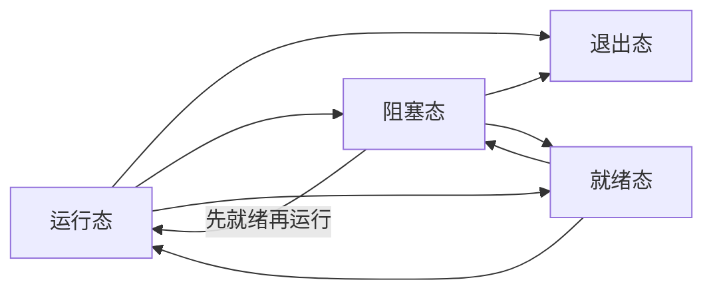

# LiteOS任务
## 基本概念
从系统的角度看，任务是竞争系统资源最小运行单元  
任务可以使用或等待CPU、使用内存空间等系统资源，并独立于其他任务运行

## LiteOS任务特性
+ 支持多任务
+ 一个任务表示一个线程
+ 抢占式调度机制
	+ 高优先级的任务可以打断低优先级的任务
	+ 地优先级任务必须等待高优先级任务阻塞或者结束才能得到调用
+ 相同优先级的任务采用时间片轮转调度方式
+ 共有32个优先级
	+ 最高优先级为0
	+ 最低优先级为31

## 任务状态
系统初始化后，创建的任务就可以在系统中竞争一定的资源，由内核进行调度  
任务状态通常分为下面四种：
+ 就绪态：该任务在就绪队列中，只等待CPU
+ 运行态：该任务正在运行
+ 阻塞态：该任务不在就绪队列中呢哦高
	+ 任务被挂起
	+ 任务被延时
	+ 任务正在等待信号量
	+ 读写队列或者等待事件等
+ 死亡态：该任务运行结束，等待系统回收资源

### 任务状态切换

#### 就序态-->运行态
任务创建之后进入就序态，发生任务切换之后， 就绪队列 中最高优先级的任务被执行，从而进入运行态  
同时该任务会被移出就序队列

#### 运行态-->阻塞态
正在运行的任务发生阻塞时，该任务慧聪就绪队列中删除，运行状态由运行态变成阻塞态，然后发生任务切换，运行就序队列中最高优先级的任务  

阻塞可能由于

+ 任务挂起
+ 任务调用延时
+ 读信号量等

#### 阻塞态-->就绪态 (阻塞态-->运行态)
阻塞的任务被恢复后，此时被恢复的任务会被加入到就绪队列，从而由阻塞态变成就序态  
如果被恢复的任务优先级高于正在运行的任务，则会发生任务切换，该任务由就绪态变成运行态

阻塞任务恢复可能因为

+ 任务恢复
+ 延时超时
+ 读信号量超时
+ 读到信号量等

#### 就绪态-->阻塞态
任务可能杂就绪态时被挂起，此时任务状态由就就绪态变成阻塞态  
被阻塞的任务从接续列表中删除，不会参与任务调度，直到该任务被解挂

#### 运行态-->就绪态
有更高优先级的任务创建或者恢复之后，会发生任务调度，此刻就序队列中最高优先级的任务变成运行态，那么原先运行的任务由运行态变为就绪态，依然在就绪队列中

#### 运行态--> 死亡态
运行中的任务运行结束，任务状态由运行态变为退出态  
退出态包含任务运行结束的正常退出状态以及 Invalid (僵尸态)  
任务如果运行结束但没有自删除，对外呈现的就是 Invalid 状态

#### 阻塞态-->退出态
阻塞的任务调用删除接口，任务直接删除

## 任务参考
### 任务ID
在任务创建时通过参数返回给用户，是用户的重要标识  
系统中的ID号是唯一的  
用户可以通过任务ID对指定任务进行任务挂起、任务恢复、查询任务名等操作

### 任务优先级
表示任务执行的优先顺序  
决定了在发生任务切换时即将要执行的任务，就绪队列中最高优先级的任务会被得到执行

### 任务入口函数
新任务得到调度后将执行的函数  
此函数由用户实现，在任务创建时，通过任务创建结构体设置  

### 任务栈
每个任务都拥有一个独立的栈空间，称之为任务栈  
栈空间中保存着包含局部变量、寄存器、函数参数、函数返回寄存器等

### 任务上下文
**任务在运行过程中使用的一些资源**，如寄存器等，称之为任务上下文。  
当这个任务挂起时，其他任务继续执行可能会修改寄存器等资源中的值  
如果任务切换时没有保存任务上下文，可能会导致任务恢复之后出现未知错误

LiteOS在任务切换时会将切出任务的任务上下文信息保存在自身的任务栈中，方便任务恢复之后继续执行

### 任务控制块TCB
每个任务都含有一个任务控制块 `TCB`  
TCB包含了

+ 任务上下文栈指针
+ 任务状态
+ 任务优先级
+ 任务ID
+ 任务名
+ 任务栈大小等信息

`TCB` 可以反映出每个任务的运行情况

### 任务切换
包含获取就序队列中最高优先级任务、切出任务上下文保存、切入任务上下文恢复等动作

### 运作机制
用户创建任务时，系统会初始化任务栈，预置上下文  
此外系统还会将 `任务入口函数` 地址放在相应的位置  
这样任务第一次启动进入运行状态时，将会执行 `任务入口函数`

[[LiteOS_任务_API]]
