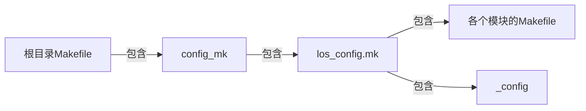

# LiteOS编译和开发工具
## 编译框架
`HUAWEI LiteOS` 使用 `Kconfig` 文件配置系统，基于 `GCC/Makefile` 实现组件化编译  

Linux下使用 `make menuconfig` 命令配置系统，`HUAWEI LiteOS` 会解析和展示目录下的 `.config` 文件和 `tools/menuconfig/config.in` 文件，`tools/menuconfig/config.in` 包含了各个模块 `Kconfig` 文件，同时在开发板的 `include` 文件夹下生成 `menuconfig.h` 文件  

`config.in` 使用 `Kconfig` 语言编写而成，`config.in` 文件决定了要展示的配置项，`.config` 文件决定各个配置选项的默认值

### 系统编译
`HUAWEI LiteOS` 通过在根目录下执行 `make` 命令完成自动化编译整个工程  
位于根目录下的 `Makefile` 文件包含了 `config.mk`  
而 `config.mk` 又包含了 `los_config.mk`   
`los_config.mk` 则包含了各个模块的 `Makefile` 和 `.config` 文件

`HUAWEI LiteOS` 支持Windows平台和Linux平台编译
+ 对于Windows平台提供了专门的图形化IDE，可以在上面进行配置和编译
+ 对于Linux平台，通过 `menuconfig` 组件配置及裁剪后，执行 `make` 命令完成编译

## 编译模块
如果之编译某个模块，而不是编译整个工程代码，在完成该模块配置后，按下面步骤完成编译
1. 导出 `LITEOSTOPDIR` 环境变量
	+ 使用 `export` 命令进行环境变量的设置

2. 编译模块
	+ 进入要执行的模块目录，执行 make 命令
