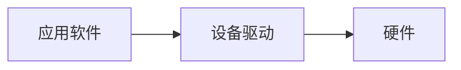
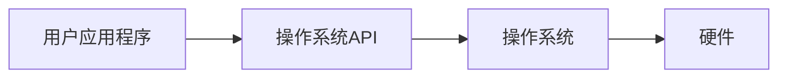
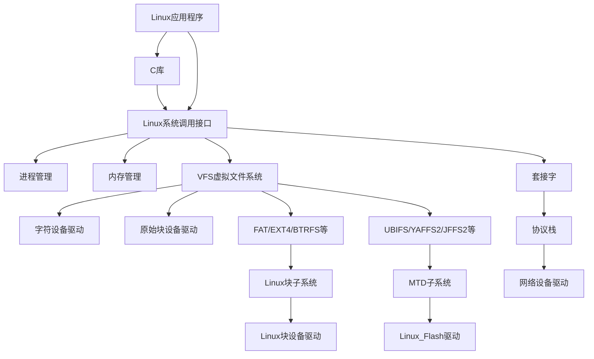

# Linux 设备驱动概述
## 设备驱动的作用
没有硬件的软件是 `空中楼阁` ，没有软件的硬件是 `一堆废铁` ，计算机系统的软件与硬件相互成就对方。

### 软件工程师与驱动工程师
**软件工程师** 需要看到一个没有硬件的纯粹的软件世界，硬件必须透明的呈现给他们。而这个步骤需要 **驱动工程师** 来完成。  

驱动与底层打直接接触，按照硬件的具体工作方式，读写设备的寄存器，完成设备的 轮询、DMA通信，进行物理地址向虚拟地址的映射等，最终让通信设备能够完成通信功能，现实设备能够显示数据，存储设备能够正常读写存储。

**设备驱动充当了纯硬件与纯软件之间的纽带**  
软件工程师只需要调用对应的API就可以控制硬件完成相应的工作。

在没有操作系统时，驱动工程师 可以根据硬件的特点自行定义硬件驱动的接口，而在有操作系统的情况下，驱动 `架构` 则由 `操作系统` 定义，驱动工程师必须按照相应的架构设计驱动，这样驱动才能良好的整合到操作系统的 `内核` 中。

>简单来说，驱动工程师负责硬件工程师和软件工程师之间的 "沟通"

## 有无操作系统对驱动程序的影响
### 无操作系统
无操作系统的设备驱动类似于单片机开发步骤，只是单纯在一个 `while()循环` 中轮询任务函数。  
一般情况下，每一种设备的驱动都会定义一个专属于这个设备的模块，包含 `.c文件` 和 `.h文件` 。

设备驱动包括串口的收发功能、LED的亮灭、Flash的读写等  
硬件就是对应的串口外设、LED所对应的GPIO、Flash所对应的SPI

### 有操作系统的设备驱动
无论有没有操作系统，对应的硬件驱动程序是必不可少的。  
要将驱动融入内核，为了实现这种融合，必须在所有设备中设计 `面向操作系统内核的接口`。  
这中接口由操作系统而定，**对于一类设备而言结构一致，又独立于不同设备**。  

当系统中存在操作系统时，驱动变成了连接 `硬件` 与 `内核` 的桥梁。  

把单一的 `驱使硬件设备行动` 变成了操作系统与硬件交互的模块，对外呈现为操作系统的API，而不再给应用软件工程师直接提供接口。

#### 操作系统的意义
一个复杂的软件系统需要处理多个并发的任务，没有操作系统，想完成多任务并发是比较困难的。

## Linux 设备驱动
### Linux设备驱动分类
计算机系统的硬件主要由 `CPU` 、`存储器` 和 `外设` 组成。  
随着 `IC` 工艺的发展，芯片的集成度越来越高，往往在CPU内部就集成了 `存储器` 和 `外设适配器` 。  
例如相当多的ARM、PowerPC、MIPS等处理器都集成了 `UART`、`I2C控制器`等。

驱动程序是针对于 `存储器` 和 `外设` ，而不是针对CPU的内核。  
**Linux将存储器和外设分为3个基础大类**
+ 字符设备
+ 块设备
+ 网络设备

**字符设备是指那些必须以串行顺序依次进行访问的设备**  
**块设备可以按任意顺序进行访问，以块为单位进行操作。**
在Linux系统中，网络设备是面向数据包的接收和发送而设计的，并不倾向于对应文件系统的节点。

### Linux设备驱动与整个软硬件系统的关系

除网络设备外，字符设备与块设备都被映射到Linux文件系统和目录，通过文件系统调用接口
+ open()
+ write()
+ read()
+ close()

等接口即可以访问字符设备和块设备。  
所有字符设备和块设备都统一呈现给用户。  

Linux块设备有两种访问方法  
一种是类似于 `dd` 命令对应的原始块设备，如 `/dev/sda`。  
另一种方法时在块设备上建立文件系统，然后对其进行访问。

应用可以使用Linux系统调用接口编程，也可以使用C库函数，出于代码的可移植性目的，C库更值得使用

