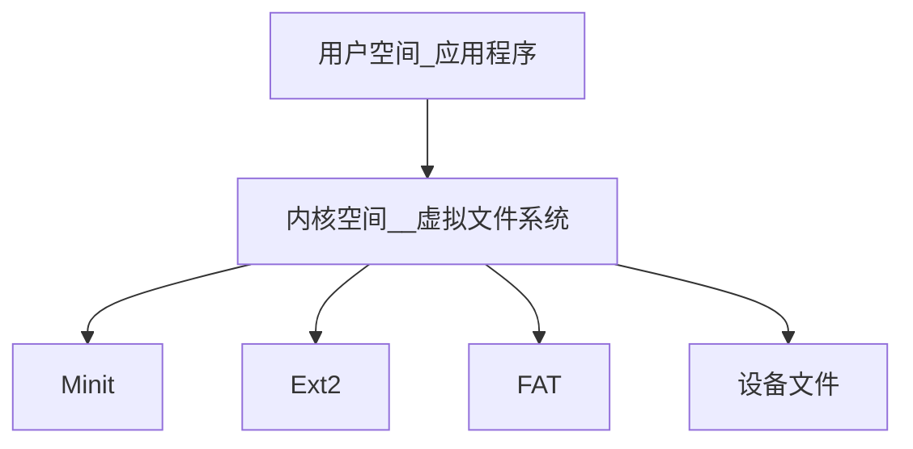

# 内核及内核编程
## Linux内核组成
### Linux内核源代码目录结构
Linux内核源代码目录如下：  
[Linux_通用底层](../../../Linux/Linux通用知识/Linux_通用底层.md)  
内核一般要做到 `drivers` 与 `arch` 的软件架构分离，驱动中不包含板级信息，让驱动跨平台。
内核的通用部分(Kernel,fs,ipc,net等)与具体硬件(arch和drivers)分离。

### Linux内核的组成部分
Linux内核主要由进程调度(SCHED)，内存管理(MM)，虚拟文件系统(VFS)，网络接口(NET)和进程间通信(IPC)五个子系统组成


#### 进程调度
进程调度控制系统中的多个进程对CPU的访问，使得多个进程在CPU中 “微观串行，宏观并行” 地执行。
系统调度处于系统的中心位置，内核中其他的子系统都需要依赖它，因为每个子系统都需要挂起或者恢复进程。


在Linux内核中，使用 `task_struct` 结构体来描述进程，该结构体包含描述该进程内存资源、文件系统、文件资源、tty资源、信号处理等的指针。  
Linux线程采用轻量级进程模型来实现，在用户空间通过 `pthread_create()` API创建线程的时候，本质上内核只是创建了一个新的 `task_struct` ，并将新的 `task_struct` 的所有资源指针都指向创建它的那个 `task_struct` 的资源指针。


#### 内存管理
内存管理的主要作用是控制多个进程共享内存区域，当CPU提供内存管理单元MMC时，Linux内存管理对于每一个完成从虚拟内存到物理内存的转换。  
`Linux2.6引入了对无MMU CPU的支持`  

一般而言，32位处理器的Linux的每个进程享有4GB的内存空间，0～3GB属于用户空间，3～4GB属于内核空间、内核空间对常规内存、IO设备内存以及高端内存有不同的处理方式。  

内核空间和用户空间的具体界限是可以调整的，在内核配置选项Kernel Features -> Memory split下，可以设置界限为2GB或者3GB。

Linux进程地址空间  

| 虚拟地址空间的内核空间部分(1GB)      |
| ------------------------------------ |
| **进程n虚拟地址空间的用户空间部分(3GB)** | 

Linux内核的内存管理总体比较庞大，包含底层的 `Buddy算法` ，它用于管理每个页的占用情况，内核空间的 `slab` 以及用户空间的C库的二次管。

另外，内核也提供了页缓存的支持，用内存来缓存磁盘， `per-BDI flusher` 线程用于刷回脏的页缓存到磁盘。 `Kswapd(交换进程)` 则是Linux中用于页面回收(包括file_backed的页和匿名页)的内核线程，它最少使用 `LRU` 算法进行内存回收。

#### 虚拟文件系统
虚拟文件系统隐藏了各种硬件的具体细节，为所有设备提供了统一的接口。而且它独立于各个具体的文件系统，是对各种文件系统的一个抽象。  
它为上层应用提供了统一的 `vfs_read()`、`vfs_write()` 等接口，并调用底层文件系统或者设备驱动中实现 `file_operations` 结构体的成员函数。



	
#### 网络接口
提供了对各种网络标准的存取和各种网络硬件的支持。

Linux内核支持的协议栈种类较多，如 `Internet`、`UNIX`、`CAN`、`NFC`、`Bluetooth`、`WiMAX`、`IrDA`等，上层的应用统一使用套接字接口。

#### 进程间通信
Linux支持进程之间的多种通信机制：
+ 信号量
+ 共享内存
+ 消息队列
+ 管道
+ UNIX域套接字  
	等

这些机制可以协助多个进程、多资源的互助访问，进程间的同步和消息传递。  
`在实际的Linux应用中，更多的趋向于使用 UNIX域套接字 而不是System V IPC中的消息队列等机制 `
`Andriod内核则新增了 Binder 进程间通信方式。`

### Linux内核空间与用户空间
现代CPU往往实现了不同的操作模式(级别)，不同模式有不同功能，高层程序往往不能访问低层功能，必须通过某种方式切换到低级模式。  
Linux系统可以充分利用这个特点，但是Linux只是用到了两级。  

在Linux系统中，内核可以进行任何操作，应用程序则被禁制对硬件直接访问和对内存进行未授权访问。  

内核空间和用户空间这两个词来区分程序执行的两种不同状态，它们使用不同的地址空间。  
**Linux只能通过 `系统调用` 和 `硬件中断` 从用户空间到内核空间的控制转移。**

## Linux内核的编译和加载
### Linux内核的编译
Linux驱动开发者需要掌握Linux内核的编译方法以为嵌入式系统构建可运行的Linux操作系统映像。  
在编译内核时，需要配置内核，可以使用下面的命令中的一个

| 命令            | 说明                         |
| --------------- | ---------------------------- |
| make config     | 基于文本的最为传统的配置界面 |
| make menuconfig | 基于文本菜单的配置界面       |
| make xconfig    | 要求QT被安装                 |
| make gconfig    | 要求GTK+被安装               |

运行
```shell
ARCH=arm make menuconfig
```
显示如图：

`内核配置的条目相当多。`  

编译内核和模块的方法分别是

| 命令                  | 说明     |
| --------------------- | -------- |
| make ARCH=arm zImage  | 编译内核 |
| make ARCH=arm modules | 编译模块 |

执行之后，源代码的根目录下会得到未压缩的内核映像 `vmlinux` 和内核符号表文件 `System.map`   
在 `arch/arm/boot` 下会得到压缩的内核映像 `zImage` 
在内核各对应目录得到选中的内核模块。

Linux内核的配置由三个部分组成：
+ Makefile：分布在Linux的源代码中，定义Linux内核编译规则。
+ 配置文件(Kconfig)：给用户提供配置选择的功能。
+ 配置工具：包括配置命令解释器和配置用户界面


使用 `make config` 、`make menuconfig` 等命令后，会生成一个 `.config` 文件，记录哪部分被编译入内核，哪部分被编译为内核的模块。

运行 `make menuconfig` 等时，配置工具首先分析与体系结构对应的 `arch/xxx/Kconfig` 文件(xxx即传入ARCH的参数)，`arch/xxx/Kconfig` 文件会通过 `source` 再引入其他的 `Kconfig` 文件，向下还可以再次引用，最终实现那个UI的配置界面。

### Kconfig 和 Makefile
**在Linux内核中添加程序需要完成三个步骤**
+ 将编写的源代码复制到Linux内核的源代码的相应目录中。
+ 在目录的Kconfig文件中增加关于新代码对应项目的编译配置选项。
+ 在目录的Makefile文件中增加对新代码的编译条目。

#### Makefile
这里的 `Makefile` 主要指各级子目录中 `kbuild(内核编译系统)Makefile` 进行介绍。  
这部分 `Makefile` 是内核模块或者设备驱动者容易接触到的。

##### 目标定义
用来定义哪些内容要作为模块编译，哪些内容要编译进内核。  
例如：  

```makefile
obj-y += foo.o
```

表示由foo.s或者foo.s文件编译得到的foo.o并链接进内核(无条件编译，所以不需要Kconfig配置选项)   
而 `obj-m` 则表示该文件要作为模块编译。  
`obj-n` 表示目标不会被编译。  

更常见的做法是根据 `make menuconfig` 后生成的 `.config` 文件的 `CONFIG_` 变量来决定文件的编译方式:

```makefile
obj-$(CONFIG_ISDN) += isdn.o
obj-$(CONFIG_ISDN_PPP_BSDCOMP) += isdn_bsdcomp.o
```

除了具有 `obj-` 形式的目标以外，还有 `lib-y` library库、`hostprogs-y` 主机目标程序等目标，但是这两类都是在特定场合下使用的。

##### 多文件模块的定义
最简单的 `Makefile` 只需要一行就够了，如果是一个模块，或者是多个文件组成的，就会复杂一些，这时候采用 `模块名+y`，或者 `-objs` 后缀的形式来定义模块的组成文件。

```makefile
obj-$(CONFIG_EXT2_FS) += ext2.o
ext2-y := balloc.o dir.o file.o fsync.o ialloc.o inode.o \
		  ioctl.o namei.o super.o symlink.o
ext2-$(CONFIG_EXT2_FS_XATTR) += xattr.o xattr_user.o xattr_trusted.o
ext2-$(CONFIG_EXT2_FS_POSIX_ACL) += acl.o
ext2-$(CONFIG_EXT2_FS_XIP) += xip.o
```

模块的名字叫做 `ext2` ，由balloc.o dir.o file.o等多个目标文件最后生成ext2.o，直至ext2.ko文件，并且时候包括 xattr.o，acl.o等取决于内核配置文件的配置情况  
例如如果 `CONFIG_EXT2_FS_POSIX_ACL` 被选择，则编译 `acl.c` 得到 `acl.o` 并最终链接进ext2.o。

##### 目录层次的迭代
例如：  

```makefile
obj-$(CONFIG_EXT2_FS) += ext2/
```

当 `CONFIG_EXT2_FS` 的值为`y`或者`m`时，`kbuild` 将会把 `ext2` 目录列入向下迭代的目标中。

#### Kconfig
内核配置脚本文件  

##### 配置选项
大多数内核配置选项都对应着 `Kconfig` 中的一个配置选项(config)。  

```Kconfig
config MODVERSIONS
	bool "Modules versioning support"
	help 
		Usually, you have to use modules compiled with your kernel. 
		Saying Y here makes it ...
```

`config` 定义新的配置选项，之后的几行代码定义了该配置选项的属性。  
配置选项的属性包括  
+ 类型
+ 数据范围
+ 输入提示
+ 依赖关系
+ 选择关系
+ 帮助信息
+ 默认值等

每个配置选项都必须指定类型，类型包括  
+ bool
+ tristate
+ string 
+ hex
+ int

其中，`tristate` 和 `string` 是两种基本类型，其他类型都基于这两种基本类型。  
类型定义后可以紧跟着输入提示  
下面两段脚本是等价的：  
```Kconfig
bool "Networking support"
```
和
```Kconfig
bool 
prompt "Networking support"
```

+ 输入提示的一般格式为  
**prompt \<prompt> \[if \<expr>]**  
其中，可选的if用来表示该提示的依赖关系
+ 默认值的格式为
**default \<expr> \[if \<expr>]**
如果用户不设置配置的选项，那么默认的值就是这个值。
+ 依赖关系的格式为  
**depend on (或者requires) \<expr>**  
如果定义了多层依赖关系，那么他们之间用 `&&` 间隔。  
依赖关系也可以应用到该菜单中所有的其他选项(同样接受if表达式)内。  
下面两段脚本是等价的  
```Kconfig
bool "foo" if BAR
default y if BAR
```
和
```Kconfig
depends on BAR
bool "foo"
default y
```
+ 选择关系格式为  
**select \<symbol> \[if \<expr>]**  
A如果选择了B，那么B被选中的情况下，A会自动被选中  

+ 数据范围格式为  
**range \<symbol> \<symbol> \[if \<expr>]**  

Kconfig中的 `expr(表达式)` 定义为  
```Kconfig
<expr> ::= <symbol>
		<symbol> '=' <symbol>
		<symbol> '!=' <symbol>
		'(' <expr> ')'
		'!' <expr>
		<expr> `&&` <expr>
		<expr> '||' <expr>
```
也就是说，`expr` 是由symbol、两个symbol相等、两个symbol不等、以及expr赋值、与或非运算构成。而symbol分为两类，一类由菜单入口配置选项定义的非常数symbol，另一个类是作为expr组成部分的常数symbol。

+ 帮助信息的格式为：  
help(或者---help---)

##### 菜单结构
配置选项在菜单树结构中位置可由两种方法决定。  
第一种方式为：
```Kconfig
menu "Network device support"
	depends on NET

config NETDEVICES
	...	
endmenu
```

所有处于 `menu` 和 `endmenu` 之间的配置选项会成为 "Netwrok device support"，子菜单，而且，所有子菜单(config)选项都会继承父菜单(menu)的依赖关系，比如 `Network device support` 对 `NET` 的依赖会被加到配置选项 `NETDEVICE` 的依赖表中。

`menu` 后面跟的 `Network device support` 仅仅是一个菜单，没有对应真实的配置选项，也不具备3种不同的状态。这是它和config的区别。

另一种方式是通过分析依赖关系生成菜单结构。如果菜单项在一定程度上依赖于前面的选项，它就能成为该选项的子菜单。  
如果父选项为 `n`，子选项不可见;
如果父选项可见，子选项才可见。

例如：  
```Kconfig
config MODULES
	bool "Enable loadable modules support"

config MODVERSION
	bool "Set version information on all module symbols"
	depends on MODULES
	
comment "modules support disabled"
	depends on !MODULES
```
`MODVERSION` 直接依赖 `MODULES` ，只有 `MODULES` 不为 `n` 时，该选项才可见。   

除此之外，`Kconfig` 中还可能使用 `choice...endchoice`、`comment`、`if ... endif`这样的语法结构。其中，`choice...endchoice` 的结构为：  

```Kconfig
choice
<choice options>
<choice block>
endchoice
```

它定义一个选择群，其接受的选项(choice options)可以是**前面描述的任何属性**。

#### 实际应用
在内核中新增驱动代码目录和子目录  
如下用于test driver的树形结构  


在内核中增加目录和子目录时，需要为其相应的新增目录添加 `Makefile` 和 `Kconfig` 文件，而新增目录的父目录中的 `Makefile` 和 `Kconfig` 也要进行修改，以便新增的 `Makefile` 和 `Kconfig`能被引用。

在新增的test目录下，应该新增如下的Kconfig文件  
```Kconfig
# 
# TEST driver configuration
# 
menu "TEST Driver"
comment " TEST Driver"

config TEST
	bool "TEST Support "

config TEST_USER
	tristate "TEST user-space interface"
	depends on TEST
endmenu
```

由于 `test driver` 对内核来说是新功能，所以要先创建一个菜单 `TEST Driver` 。然后显示 "TEST support"，等待用户选择。接下来判断用户是否选择了 `TEST Driver`，如果选则了，(CONFIG_TEST=y)，则进一步显示子功能：**用户接口与CPU功能支持**。  
由于接口功能可能被编译进入内核模块，所以这里询问语句使用了 `tristate`。

为了能够使这个 `Kconfig` 能够起作用，修改 `arch/arm/Kconfig` 文件，增加：
```Kconfig
source drivers/test/Kconfig
```
在脚本中新增 `source` 意味着新增 `Kconfig文件` (有点类似于vim的配置)。

在新增的test目录下，应该包含Makefile文件:
```makefile
# driver/test/Makefile
# 
# Makefile for the TEST
# 
obj-$(CONFIG_TEST) += test.o test_queue.o test_client.o
obj-$(CONFIG_TEST_USER) += test_ioctl.o
obj-$(CONFIG_TEST_PROC_FS) += test_proc.o

obj-$(CONFIG_TEST_CPU) += cpu/
```
该脚本根据配置变量的取值，构建`obj-*列表`   
由于test目录中包含一个子目录cpu，因此当 `CONFIG_TEST_CPU=y` 时，需要将CPU目录加入该列表中。

test目录中的cpu目录也应该包含如下 `Makefile`
```makefile
# drivers/test/test/Makefile
# 
# Makefile for the TEST CPU
# 
obj-$(CONFIG_TEST_CPU) += cpu.o
```

为了编译命令能够达到整个test目录，test目录的父目录中Makefile也需要添加如下的脚本  
```makefile
obj-$(CONFIG_TEST) += test/
```

增加了 `Makefile` 和 `Kconfig` 的目录为


### Linux内核引导
引导Linux系统的过程包括很多阶段，以ARM Linux为例，一般的 `SoC` 内嵌了 `bootrom` ，上电时 `bootrom` 运行。对于 `CPU0` 而言，bootrom回去引导 `bootloader`，而其他CPU则判断自己是不是CPU0，进入 `WFI` 状态等待 `CPU0` 来唤醒它。


在内核启动阶段，`CPU0` 会出发中断唤醒 `CPU1` ，之后 `CPU0` 和 `CPU1` 都投入运行。  
`CPU0` 导致用户空间的 `init` 程序被调用，`init` 程序再调用其他进程。  
`CPU0` 和 `CPU1` 会共同负担这些负载，进行负载均衡。

`bootrom` 是根据各个 `SoC` 厂家根据自身情况编写的，目前的SoC一般都具有能从SD、eMMC、NAND、USB等介质启动的能力。

嵌入式系统最著名的 `bootloadler` 是 `U-Boot`  