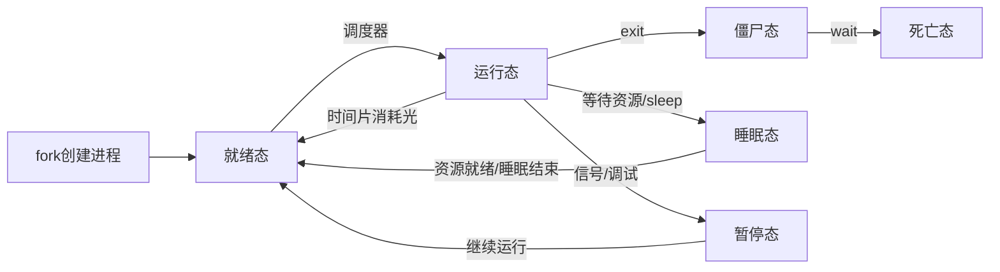

# 进程

## 进程的由来

### 程序的构成

程序由若干代码段构成\
类似于 [C语言内存管理](../../../../../../语言和脚本/编程语言/C系语言/C语言/c语言内存管理.md) 这部分知识

- .text
- .data
- .rodata
- .bss

Linux 系统中有一个 task_struct 结构体控制着进程

### 进程由来

进程在不运行时，就是一个 **静态的文件**，存储在硬盘的某个位置\
当程序运行时，会被系统载入[虚拟内存](../../内核驱动编程/书上内容笔记/Linux_物理地址与虚拟地址.md) 中，成为 **一个运行着的实体**

进程是由另一个进程所创建\
在 Linux 中运行 `pstree` 命令可以查看进程之间的父子关系

### 操作系统区分进程的方式

操作系统通过 `PID` 区分不同的进程，通过 `ps -ef` 命令可以查看不同的进程的 PID

## 创建进程

通过 `fork()` 函数创建一个新的进程

```c
// 头文件
#include<unistd.h>
// 函数原型
pid_t fork(void);
/* 
 * 成功：父进程返回 正整数，子进程返回 0
 * 失败：-1
*/
```

执行 `fork()` 函数会返回两次，新进程返回的值为其 `PID`，`fork()` 函数更像是复制一个进程

**在执行 fork 函数之前，操作系统中只执行这一个进程，fork 函数之后会有 两个 几乎一样的 这个进程**

- fork 之前的代码执行一遍
- fork 之后的代码执行两遍

```c
#include <stdio.h>
#include <unistd.h>

int main(int argc, char *argv[]) {

  pid_t fk_pid ;
  printf("Before Fork\n");

  fk_pid = fork();
  printf("After fork, new pid = %d\n",fk_pid);

  return 0;
}
```

### 子进程切换为其他进程

通过 `exec 函数族` 完成程序的替换功能

| 常用后缀 | 功能                       |
| ---- | ------------------------ |
| l    | 代表以列表形式传参                |
| v    | 代表以矢量组的形式传参              |
| p    | 代表使用环境变量 PATH 来寻找指定的执行文件 |
| e    | 代表用户提供自定义的环境变量           |

```c
// 头文件
#include<unistd.h>
// 函数原型
int execl(const char *path, const char *argc, ...)
int execlp(const char *file, const char *argc, ...)
int execv(const char *path, char *const *argv[], ...)
int execve(const char *path, char *const *argv[], char *const envp ...)
/* 
 * 返回值
 * 成功：不返回
 * 失败：-1
 */
```

- l 和 v 选其中一个使用
- p 和 e 后缀可用可不用
- exec 函数可能执行失败，需要加测试条件
  - 错误条件可能是新进程的文件路径有问题
  - 传参或者自定义环境变量时没有加 NULL
  - 要执行的文件没有执行权限

## 进程的退出

### 退出进程

Linux 内核中进程正常退出有三个方法：

- 从 main 函数中 return
- 调用 exit() 函数终止
- 调用 _exit() 函数终止

### exit 和 _exit 函数

```c
// 头文件
#include<stdlib.h>
#include<unistd.h>
// 函数原型
void exit(int status);
void _exit(int status);
/* 
 * 无返回值
 */
```

执行 exit/_exit 函数会将 task_struct 结构体消灭掉

exit 会查看当前进程是否具有 IO 缓存区，如果有 IO 缓存区则会对 IO 缓存区的数据进行处理，然后才会退出\
_exit 直接退出

### 等待子进程的终结

父进程通过 wait 函数查询子进程的状态

```c
// 头文件
#include<sys/wait.h>
// 函数原型
pid_t wait(int *status);
/*
 * 返回值：
 * 成功：子进程的 PID
 * 失败：-1
 */
```

## 进程的产生运行和结束



### 进程状态

- TASK_RUNNING：就绪/运行态
- TASK_INTERRUPTIBLE：可中断睡眠态
- TASK_UNINTERRUPTIBLE：不可中断睡眠态
- TASK_TRACED：调试状态
- TASK_STOPPED：暂停态
- EXIT_ZOMBIE：僵尸态
- EXIT_DEAD：死亡态

