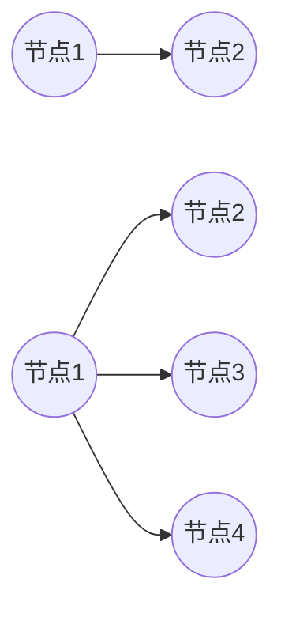
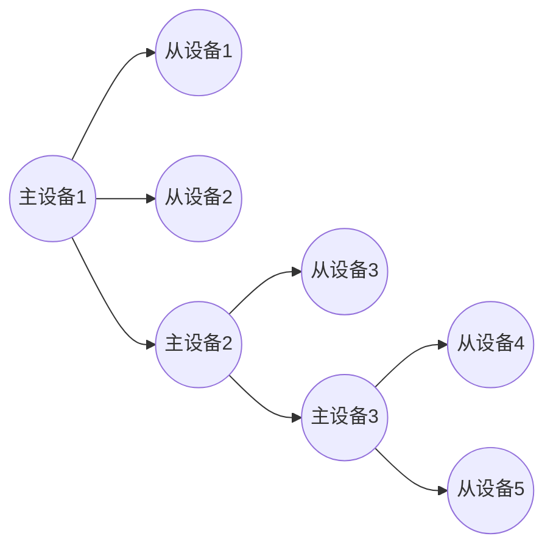

# 蓝牙无线通信技术
## 简介
蓝牙技术实际上时一种短距离无线通信技术
蓝牙技术是将网络中各种外围设备接口的统一桥梁，它消除了设备之间的连线，以无线取而代之
通过芯片上的无线接收装置，配有蓝牙技术的无限电子产品能够在10M左右的距离彼此相通，传输速率可以达到1Mbps

### 技术特点
蓝牙是一种短距离无线通信规范，起初的目标是取代现有的计算机外设和移动电话等各种数字设备上的有线电缆连接
工作频段为全球免费免申请2.4GHz

蓝牙设备小体积，并且低功耗(一粒纽扣电池低功耗下可以用几年)，几乎可以被集成到任何数字设备中，特别是对传输速率要求不高的移动设备和便携设备

蓝牙设备建立连接时，主动发起连接请求的为主设备，响应方为从设备
当几个蓝牙设备连接成一个微微网时，只有一个主设备，其余的都是从设备

#### 微微网
`微微网`是蓝牙最基本的一种网络，由`一个主设备和一个从设备点对点连接的系统`就是最基本的微微网
几个微微网在`时间和空间上相互重叠`，进一步组成了更加复杂的网络拓扑结构，成为`散射网`
散射网中的蓝牙设备可能是某个微微网的从设备，也可能是另一个微微网的主设备

不同微微网之间的跳变频率各自独立，互不相关，其中每个微微网可由不同的`跳频序列`来标识,参与同一微微网的所有设备都与此微微网的跳频序列同步
尽管在开放的ISM频段原则上不允许有多个微微网的同步，但通用时分复用技术，一个蓝牙设备便可以同时与几个不同的微微网保持同步
具体来说，就是该设备按照一定的时间顺序参与不同的微微网，即某一时刻与一个微微网，而下一时刻与另一个微微网

#### 蓝牙的目标
+ 全球范围适用
+ 可同时传输语音和数据
+ 可以建立临时性的对等连接
+ 具有很好的抗干扰能力
+ 很小的体积，可以集成到其他设备中
+ 开放的接口标准
+ 成本低

##### 较好的抗干扰性
工作在ISM频段的无线电设备有很多种，如家用的微波炉、无线局域网和HomeRF等技术产品
蓝牙为了很好的抵消来自这些设备的干扰，采取了`跳频`方式来`扩展频谱`，将2.402~2.48GHz的频段分成79个频点，每个相邻频点间隔1MHz
`数据分组`在某个频点发送之后，再跳到另一个频点发送，而对于频点选择顺序则是随机的，每秒频率改变1600次，每个频率持续625us

##### 较低功耗
蓝牙设备在通信连接的状态下，有四种工作模式
+ 激活模式(Active)
+ 呼吸模式(Sniff)
+ 保持模式(Hold)
+ 休眠模式(Park)

激活模式是正常的工作状态，另外三种是为了节能而规定的低功耗模式

呼吸模式下的从设备周期性的被激活
保持模式下停止监听来自主设备的数据分组，但保持其激活成员地址
休眠模式下主从设备仍然保持同步，但是从设备不需要保持其激活设备的地址

这三种节能方式中呼吸模式的功耗最高，但是对主设备的响应也最快，休眠模式功耗最低，但是对主设备的响应最慢

### 蓝牙的系统组成
蓝牙的关键特性就是健壮性、低复杂性、低功耗和低成本
蓝牙工作在全球通用的2.4GHz的ISM频段，并采用`调频收发信机`来达到`抗干扰和抑制信号衰减`的作用，采用`二进制调频(FM)模式`降低收发信机的复杂性，其符号速率为1Mbps
划分为时隙的信道采用625us的标称时隙长度
蓝牙系统采用全双工时分(TDD)传输方案实现双工传输。在信道中，信息可以以分组方式进行交换，各信息分组可采用不同调频频率实现传输
理论上一个分组覆盖一个单时隙，而实际一个分组可以扩展至覆盖5个时隙.
蓝牙协议采用电路交换和分组交换的混合方式，时隙保留用于同步分组

同时，蓝牙能够支持一条异步数据信道，乃至三个同步语音信道，或一条通知支持异步数据和同步语音的信道
每个语音信道在每个方向上支持64Kbps同步语音信道连接
异步信道最大可不对称支持723.2kbps，或对称支持433.9kbps的传输速率

#### 系统组成
蓝牙系统由无线部分、链路控制部分、链路管理支持部分和主终端接口组成

蓝牙系统提供点对点的连接方式或者一对多的连接方式

在一对多的连接方式中，多个蓝牙单元之间共享一条信道
共享同一个信道的两个或两个以上的单元形成一个微微网，其中一个单元作为微微网的主单元，其余则作为从单元，在一个微微网中最多由7个活动单元。
另外更多的从单元可被锁定于某一主单元，该状态称为休眠状态，在该信道中，不能激活这些处于休眠状态的从单元但仍可使之与主单元之间保持同步
对于处于激活或休眠状态的从单元而言，信道访问都是由主单元进行控制的

具有覆盖区域的多个微微网构成一个散射网络结构，每个微微网只能有一个主单元，从单元可基于复用参加不同的微微网
另外在一个微微网中的主单元仍可作为另一个微微网中的从单元，各微微网间不必以时间或频率同步，它们有自己的`跳频信道`

## 蓝牙协议体系结构
蓝牙技术规范的目的是使符合该规范的各种应用之间能够互通，为此本地设备与远端设备需要使用相同的`协议栈`
不同应用可以在不同的协议栈上运行，但是所有协议栈都要使用蓝牙技术规范中的数据链路层和物理层

蓝牙协议栈
![[Pasted image 20210629093022.png]] 

蓝牙协议体系中的协议由`SIG`分为四层
+ 蓝牙核心协议：Baseband、LMP、L2CAP、SDP
+ 电缆替换协议：RFCOMM
+ 电话传送控制协议：TCS Binary、AT Commands
+ 选用协议：PPP、UDP/TCP/IP、OBEX、vCard、vCal、IrMC、WAE

除了协议层之外，蓝牙还规定了主机控制器接口(HCI)，它作为基带控制器、连接管理器提供命令接口，并且可通过它访问硬件状态和控制寄存器
主机控制器接口(HCI)位于L2CAP的下层但是也可以位于L2CAP的上层
蓝牙核心协议由SIG定制的蓝牙专利协议组成，绝大部分蓝牙设备都要蓝牙核心协议，而其他协议根据应用的需要而定
总之，电缆替换协议、电话控制协议和被采用的协议构成了面向应用的协议，运行各种应用运行在核心协议之上

### 蓝牙核心协议
#### 基带协议
基带就是蓝牙的物理层，它负责物理信道和链路中除了错误纠正、数据处理、调频选择和蓝牙安全之外的所有业务
基带在蓝牙协议栈中位于蓝牙射频之上，基本上起链路控制和管理作用，如承载链路连接和功率控制这类链路级路由等
基带还管理异步和同步链路、处理数据包、寻呼、查询接入和查询蓝牙设备等。
基带收发器采用时分复用TDD方案(交替发送和接收)，因此除了不同的跳频之外(频分)，时间都被划分成时隙

基带可以处理两种类型的链路：SCO(同步连接)和ACL(异步无连接)

基带和链路控制层确保了微微网内各蓝牙设备之间由射频构成的物理连接。蓝牙提供两种物理连接方式及其相应的基带数据分组：同步面向连接和异步无连接
而且在同一射频上可实现多路数据传送

ACL只用于数据分组
SCO适用于音频和数据的组合

不同的数据类型(包括连接管理信息和控制及信息)都被分配了一个特殊的通道

#### 链路管理协议(LMP)
链路管理协议(LMP)和逻辑链路控制与适应协议(L2CAP)都是蓝牙的核心协议，L2CAP与LMP共同实现OSI数据链路层的功能

LMP负责蓝牙设备之间的链路建立，包括鉴权、加密等安全技术及基带层分组大小的控制和协商，还控制无线设备的功率和蓝牙节点的连接状态
L2CAP在高层和基带层之间作适配协议，它与LMP是并列的，区别在于L2CAP向高层提供负载的传送，而LMP不负责业务数据的传送

**LMP的关键作用：**
+ 负责蓝牙组件间接的建立和断开
+ 通过监控信道特性、支持测试模式和出错处理来维护信道
+ 控制微微网内及微微网之间蓝牙组件的时钟补偿和计时精度
+ 控制微微网内蓝牙组件的工作模式
+ 链路的协议版本信息、请求命名、主从角色切换等

#### 逻辑链路控制和适配协议(L2CAP)
位于基带层之上，向上层协议提供服务，可以认为它与LMP并行工作

**L2CAP关键作用**
完成数据的拆装、基带与高层协议之间的适配，并通过协议复用、分段及重组操作为高层提供业务和分类提取，它允许高层协议和应用接受或发送达64KB的L2CAP数据包。数据重传和低级别流控也由L2CAP协议完成

