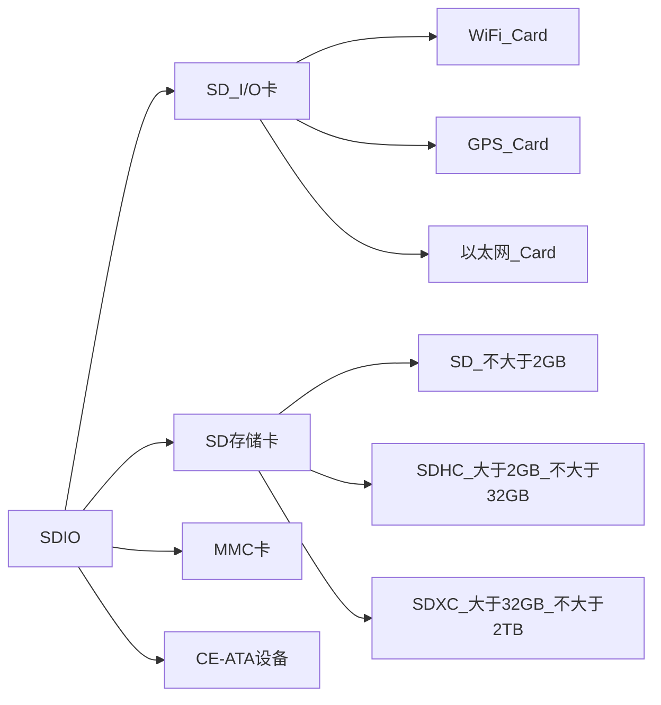

# SDIO通信协议
## SDIO协议简介
SD卡(Secure Digital Memory Card)在日常生活中比较普遍存在。  
控制器对SD卡进行读写通信操作一般有两种接口可以选择，一种是SPI接口，另一种是SDIO接口。  
SDIO全称是安全数字输入输出接口，多媒体卡(MMC)、SD卡、SD I/O卡都有SDIO接口。  
`STM32系列控制器有一个SDIO主机接口，可以与MMc卡、SD卡、SD I/O卡以及CE-ATA设备进行数据传输`  

> 相关参考  
> + [SD卡协会网站](https://www.sdcard.org)中提供了SD存储卡和SDIO卡的系统规范  
> + [CE-ATA工作组网站](https://www.ce-ata.org)中提供了CE-ATA系统规范  

## SDIO设备分类

MMC卡可以说是SD卡的前身，现阶段使用的很少。  
SD I/O卡本身不是用于存储的卡，他是指利用SDIO传输协议的一种外设，比如WiFi Card，他主要是提供了WiFi功能，而有些WiFi模块使用的是串口或者SPI进行通信的。  
一般设计SD I/O卡是可以插入到SD的插槽。  
CE-ATA是专为轻薄笔记本硬盘设计的硬盘高速通讯接口。

一些MCU所支持的最大容量根据SD卡规范的不同而不同  
`STM32F43x系列控制器只支持SD卡规范版本2.0，即不支持超大容量SDXC标准卡`  

## SDIO命令
SD命令由主机发出，以广播命令和寻址命令为，广播命令是针对与SD主机总线连接的所有从设备发送的，寻址命令是指定某个地址进行命令传输的。

### 命令格式
SD命令格式固定为48位，都是通过CMD线连续传输的，数据线不参与。

![[Pasted image 20210821234450.png]]

+ 起始位和终止位：命令的主体包含在起始位与终止位之间，他们都只包含一个数据位，起始位为0,终止位为1。
+ 传输标志：用于区分传输方向，
	+ 该位为1时表示命令，方向为主机传输到SD卡
	+ 该位为0时表示响应，方向位SD卡传输到主机
+ 命令的主体内容：
	+ 命令
		+ 占用6位，总共有64个命令(代号：CMD0～CMD63)
		+ 每个命令都有特定的用途，部分命令不适用于SD卡操作，只是专门用于 MMC卡 或者SD I/O卡
	+ 地址信息/参数
		+ 每个命令都有32为地址信息/参数用于命令附加内容，例如，广播命令没有地址信息，这32为用于指定参数，而寻址命令这32位用于指定目标SD卡的地址(4G)。
	+ CRC校验
		+ 长度为7位用于验证命令传输内容的正确性，如果发生外部干扰导致数据个别位状态改变将导致校准失败，也就意味着命令传输失败，此时SD卡不会执行命令

### 命令类型
SD命令有4种类型
+ 无响应广播命令(bc)，发送到所有卡，不返回任务响应
+ 带相应的广播命令(bcr)，发送到所有卡，同时接受来自所有卡的响应
+ 寻址命令(ac)，发送到选定卡，DAT先无数据传输
+ 寻址数据传输命令(adtc)，发送到选定卡，DAT线有数据传输

SD卡主机模块系统旨在为各种应用程序类型提供一个标准接口，在此环境中，需要有特定的客户/应用程序功能。为实现这些功能，在标准中定义了两种类型的通用命令：  
+ 特定应用命令(ACMD)
+ 常规命令(GEN_CMD)

要使用SD卡制造商特定的 `ACMD` 命令，如 `ACMD6`，需要在发送命令之前无发送 `CMD55`命令，告知SD卡接下来的命令为特定应用命令。`CMD55` 命令只对紧接着的第一个命令有效，SD卡如果检测到 `CMD55` 之后的第一条命令为 `ACMD` 则执行其特定应用功能，如果检测发现不是 `ACMD` 命令则执行特定应用功能，如果检测发现不是 `ACMD` 命令，则执行标准命令。

## 响应
SD卡向主机发出，部分命令要求SD卡做出响应，这些响应多用于反馈SD卡的状态，基本特征如下：
+ SDIO总共有7个响应的类型(代号R1～R7)，其中SD卡没有R4、R5类型响应的。
+ 特定的命令有特定的响应类型
+ SD卡的响应通过CMD线连续传输的
+ 根据响应内容大小可以分为短响应和长响应。
	+ 短响应是48为
	+ 只有R2类型是长响应，其长度是136位

 