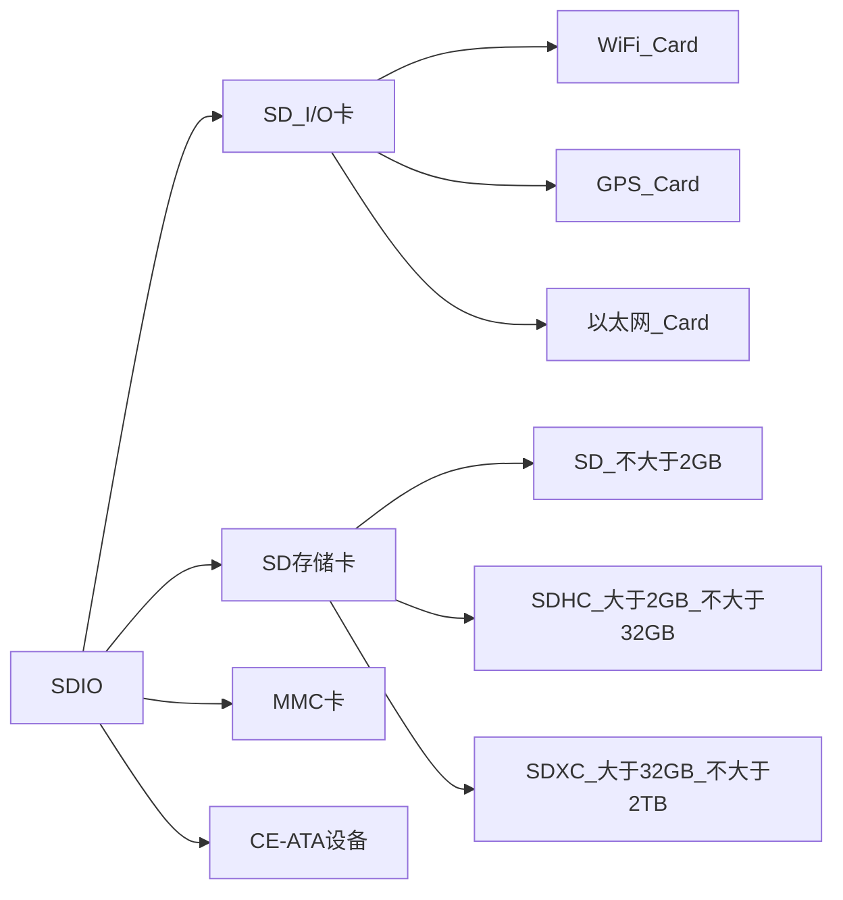

# SDIO通信协议
## SDIO协议简介
SD卡(Secure Digital Memory Card)在日常生活中比较普遍存在。  
控制器对SD卡进行读写通信操作一般有两种借口可以选择，一种是SPI接口，另一种是SDIO接口。  
SDIO全称是安全数字输入输出接口，多媒体卡(MMC)、SD卡、SD I/O卡都有SDIO接口。  
`STM32系列控制器有一个SDIO主机接口，可以与MMc卡、SD卡、SD I/O卡以及CE-ATA设备进行数据传输`  

> 相关参考  
> + [SD卡协会网站](https://www.sdcard.org)中提供了SD存储卡和SDIO卡的系统规范  
> + [CE-ATA工作组网站](https://www.ce-ata.org)中提供了CE-ATA系统规范  

## SDIO设备分类

MMC卡可以说是SD卡的前身，现阶段使用的很少。  
SD I/O卡本身不是用于存储的卡，他是指利用SDIO传输协议的一种外设，比如WiFi Card，他主要是提供了WiFi功能，而有些WiFi模块使用的是串口或者SPI进行通信的。  
一般设计SD I/O卡是可以插入到SD的插槽。  
CE-ATA是专为轻薄笔记本硬盘设计的硬盘高速通讯接口。

一些MCU所支持的最大容量根据SD卡规范的不同而不同  
`STM32F43x系列控制器只支持SD卡规范版本2.0，即不支持超大容量SDXC标准卡`  

