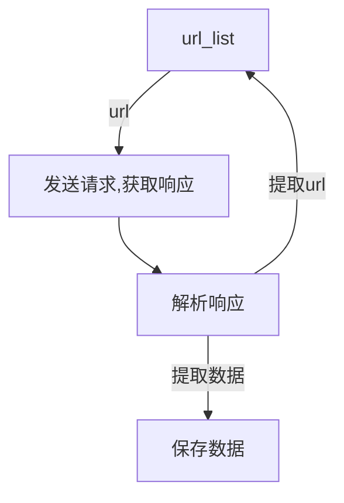

# HTTP协议
提起 `http` 协议，会想起它是一个应用层协议，http协议和爬虫也有一定关联  

发送请求，获取响应使用的是 `http/https` 协议

## http以及https的概念和区别
**https比http更安全，但是性能更低**  
+ HTTP：超文本传输协议，默认端口号是80
	+ 超文本：超过文本，不限于文本还包括图片、音频、视频等
	+ 传输协议：指使用的公共约定的固定格式来传递转换成字符串的朝文本内容
+ HTTPS：HTTP+SSL(安全套接字层)，带有安全套接字层的朝文本传输协议，默认端口号是443

