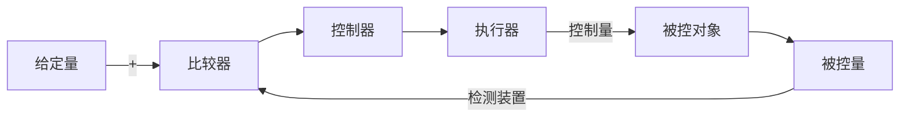

# 闭环控制系统
## 电机调速问题
以点击调速问题为例子，调节`PWM`可以实现点击调速，传感器可以检测其他因素，例如编码器可以检测电机的转速
如果需要控制点击转速为某个值，并且时控制不同负载电机都运行在这个速度。
要是想要实现这样的功能，就需要添加**控制系统**

## 自动控制系统
自动控制系统是在无人直接参与下可以使生产过程或其他过程按照期望规律或者预定程序进行的控制系统。
自动控制系统是实现自动化的主要手段，简称为自控系统
自动控制系统可以分为**开环控制系统**和**闭环控制系统**
一个系统包括**控制器**、**传感器**、**变送器**、**执行机构**、**输入输出接口**
具体过程是：
**控制器**的输出经过**输出接口**、**执行机构**加到被控系统上;控制系统的**被控量**经过**传感器**、**变送器**，通过**输入接口**送到控制器
**不同控制系统的传感器、变送器、执行机构是不一样的。**

### 开环控制系统
被控对象的输出对控制器的输出没有影响的控制系统
在开环控制系统中，系统输出只受输入的控制，控制精度和抑制干扰的特性比较差。
`在开环控制系统中，基于时序进行逻辑控制的称为顺序控制系统，由顺序控制装置、检测元件、执行机后和被控工业对象所组成`

### 闭环控制系统
系统被控对象会反送回来来影响控制器的输出，形成一个或者多个闭环的控制系统。
把控制系统的输出量的一部分或者全部，通过一定的方式和装置反送回系统的输入端，然后将反馈信息与原输入信息进行比较
再将比较的结果施加于系统进行控制，避免系统偏离预定的目标
**闭环系统用的是负反馈**

### 反馈
又称为回馈，是控制论的基本概念，指将系统的输出返回到输入端并以某种方式改变输入，进而影响系统功能的过程。
反馈可以分为负反馈和正反馈
+ 负反馈使**输出起到与输入作用相反的作用，使系统输出与系统目标的误差减小，系统趋于稳定**
+ 正反馈调节起到**与输入相似的作用，使系统偏差不断增大，使系统振荡，可以放大控制作用**
	+ **正反馈主要用于信号产生电路**

**对负反馈的研究是控制论的核心问题**

