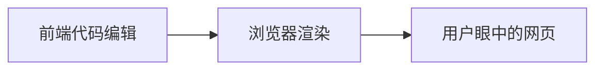

# HTML 网页

## 网页的基本概念

网站是因特网上根据一定的规则使用 `HTML` 等制作的用于展示特定内容相关的网页集合\
网页是网站中的一页，通常是 `HTML` 格式的文件，他要通过 <u>浏览器</u> 来阅读

网页是构成网站的基本元素，它通常由 **图片、链接、文字、音频、视频** 等 **元素** 组成\
通常看见的网页以

- html
- htm

为后缀的文件，因此将之称为 `HTML` 文件

## HTML

`HTML` 是指超文本标记语言(Hyper Text Markup Language)，它是用于描述网页的一种 **标记语言**\
超文本有两重含义

- 超越了文本(可以加载图片、音视频等文件)
- 可以从一个文件跳转到另一个文件(超链接文件)

## 网页的形成

网页是有 **网页元素** 组成的，这些网页元素由 HTML 标签描述出来，然后通过浏览器展现出来

## 浏览器

### 常用浏览器

浏览器是网页显示、运行的平台，常用的浏览器有  **IE浏览器、火狐(firefox)、谷歌(Chrome)、Safair和Opera等**

### 浏览器的内核

浏览器内核(渲染引擎)：负责**读取网页内容**，**整理讯息**，**计算网页的显示方式并显示页面**

| 浏览器          | 内核      |
| ------------ | ------- |
| IE           | Trident |
| firefox      | Gecko   |
| Safira       | Webkit  |
| Chrome/Opera | Blink   |

> Blink 实际上是 Webkit 的一个分支

## Web 标准

Web 标准是由 `W3C` 组织和其他标准化组织制定的一系列标准的集合\
W3C(万维网联盟)是国际上最著名的标准化组织

### Web 标准的意义

不同浏览器显示页面或者排版会有些许差异，遵循web标准可以在不同浏览器所产看的 **内容显示尽量一致**

### Web 标准的构成

主要包括 **结构**(Structure)、**表现**(Presentation)和**行为**(Behavior)三个方面

| 标准组成 | 作用                            |
| ---- | ----------------------------- |
| 结构   | 对网页元素进行整理和分类，主要是 HTML         |
| 表现   | 用于设置网页的版式、颜色、大小等外观样式，主要是 CSS  |
| 行为   | 网页模型的定义和交互的编写，主要是 JavaScripts |

