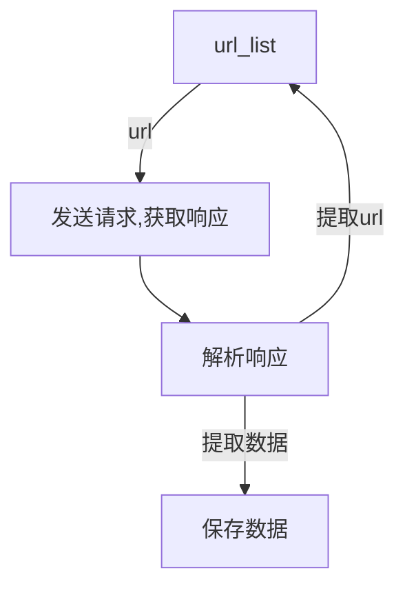

# 网络爬虫概述
## 爬虫的概念
**模拟浏览器，发送请求，获取响应**  
网络爬虫(又称为网络蜘蛛，网络机器人)就是模拟客户端(主要指浏览器)发送网络请求，接收请求响应，一种按照一定规则，自动抓取互联网信息的程序
+ 原则上只要是客户端(浏览器)能做的事，爬虫都可以做
+ 爬虫只能获取客户端(浏览器)所展示出来的数据  

## 爬虫的作用
+ 数据采集
	+ 抓取微博评论
	+ 抓取招聘网站的招聘信息
	+ 新浪滚动新闻
	+ 百度新闻网站
+ 软件测试
	+ 自动化测试等
+ 12306抢票
+ 网站上的投票
+ 网络安全
	+ 短信轰炸
	+ Web漏洞扫描

## 爬虫的分类
**根据被爬的网站的数量不同，可以分为**
+ 通用爬虫，如搜索引擎
+ 聚焦爬虫，如12306抢票，或者专门抓取某一个或者某一类网站数据

**根据是否以获取数据为目的，可以分为**  
+ 功能性爬虫，投票点赞等
+ 数据增量爬虫，比如招聘信息

**根据url地址和对应的页面内容是否改变，数据增量爬虫可以分为**
+ 基于url地址变化、内容也随之变化的数据增量爬虫
+ url地址不变，内容变化的数据增量爬虫

## 爬虫的流程

1. 获取一个url
2. 向url发送请求，并获取响应(需要http协议)
3. 如果从响应中提取url，则继续发送请求获取响应
4. 如果从响应中获取数据，则将数据进行保存

