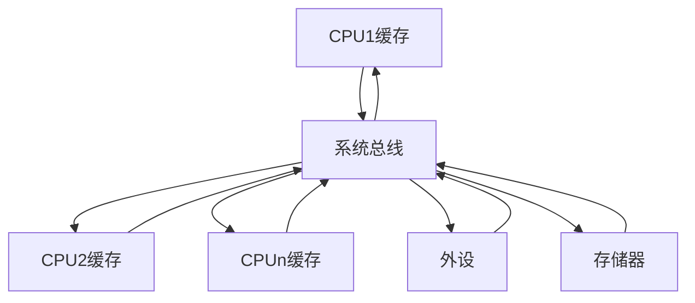

# Linux设备驱动中的并发控制
## 并发与竞态
并发(Concurrency)指的是多个执行单元同时、并行被执行，而并发的执行单元对共享资源(硬件资源和软件上的全局变量、竟态变量等)的访问很容易导致竞态。  

复杂、混乱的并发大量存在于设备驱动中，只要并发的多个执行单元存在共享资源的访问，竞态就有可能发生。主要的竞态发生于如下几种情况：

### 对称多处理器(SMP)的多个CPU 
SMP是一种紧耦合、共享存储的系统模型，体系结构如下：  


在SMP的情况下，多个核的竞态可能发生于多个CPU的进程之间

### 单CPU内进程抢占它的进程
Linux2.6之后的内核支持内核抢占调度，一个进程在内核执行的时候可能耗完了自己的时间片，也可能被另一个高优先级进程打断，进程与抢占它的进程访问共享资源的情况类似于 SMP 的多个CPU。

### 中断(硬中断、软中断、Tasklet、底半部)与进程之间
中断会打断正在执行的进程，如果中断服务程序访问进程在访问的资源，则竞态就会发生。  
多个不同优先级的中断嵌套访问相同的资源同样会导致竞态的发生。

### 竞态的解决办法
解决竞态的途径是保证对共享资源的互斥访问。  
访问共享资源的代码区域成为临界区，临界区需要被以某种互斥机制加以保护。  
`中断屏蔽`、`原子操作`、`自旋锁`、`信号量`、`互斥信号量`等是Linux设备驱动中可以采用的互斥途径。

## 编译乱序和执行乱序
有两种可能的原因会造成程序出错
+ 编译乱序
+ 执行乱序

### 编译乱序
现代的高性能编译器在目标代码优化上都具备对指令进行乱序优化的能力  

编译器可以对访问的指令进行乱序，减少逻辑上不必要的编译器访存，以尽量提高 `Cache` 命中率和 CPU 的 `Load/Store` 单元的工作效率。  
因此打开编译器优化之后，看到的汇编代码没有严格按照代码的逻辑顺序执行，是正常的。

解决编译乱序的问题，需要通过 `barrier()` 编译屏障进行  
可以在代码中设置 `barrier()` 屏障，可以阻挡编译器优化

```c
#define barrier() __asm__ __volatile__("":::"memory")
```

关于解决编译乱序的问题，C语言 `volatile` 关键字的的作用较弱，它更多的只是避免内存访问行为的合并，对C编译器而言，`voiatile` 是暗示除了当前的执行线索外，其他的执行线索也可能改变内存，所以它的含义是 "易变的"。  

>如果线程A读取var这个内存的变量两次而没有修改var  
>编译器可能觉得修改一次就足够了，第二次直接换取第一次的结果。  
>但是加了 `volatile` 关键字来形容var  
>就是告诉线程B、线程C或者其他执行实体可能会更改var的值  
>因此不会进行上述的优化。

另外，`volatile` 关键字不具备保护临界资源的作用

> Linux内核不太喜欢 `volaitle` 


### 执行乱序
高级的CPU可以根据自己的缓存组织特性，将访存指令重新排序执行，连续执行的访问可能会被先执行，因为这样缓存的命中率高，有的还允许方寸的非阻塞，即如果前面一条指令因为缓存不命中，造成长延时的存储访问时，后面的访存指令可以先执行，以便从缓存中取数。  
因此即使从会边上看顺序是正确的指令，其执行顺序也是不可预知的

处理器为了解决多核间一个核的内存行为对另一个核可见的问题，引入了一些内存屏障指令

| 指令              | 说明                                                               |
| ----------------- | ------------------------------------------------------------------ |
| DMB(数据内存屏障) | 在DMB之后的显式内存访问前，保证所有DMB指令之前的内存访问完成       |
| DSB(数据同步屏障) | 等待所有在DSB指令之前的指令完成                                    |
| ISB(指令同步屏障) | Flush流水线，使得所有的ISB之后执行的指令都是从缓存或者内存中获得的 |

Linux的自旋锁、互斥体等互斥逻辑需要用到上述指令
+ 在请求获得锁时，调用屏障指令
+ 在解锁时，也需要调用屏障指令

单个CPU碰到依赖点时会等待，执行乱序对单核CPU不一定可见。  
但是当程序在访问外设的寄存器时，这些寄存器的访问顺序在CPU的逻辑上不构成依赖关系，但是从外设的逻辑角度来讲，也可能需要固定的寄存器读写顺序，也需要使用CPU的内存屏障指令。  

>内核文档 `Documentation/memory-barries.txt` 和 `Documentation/io_ordering.txt` 对这些内容进行了描述

在Linux内核中定义了
+ 读写屏障 `mb()`
+ 读屏障 `rmd()`
+ 写屏障 `wmd()`
+ 用于寄存器读写的 
	+ `__iormb()`
	+ `__iowmb()`等

## 中断屏蔽
单CPU范围内避免竟态的一种简单而有效的方法是在进入临界区之前屏蔽系统中断。但是在驱动编程中不值得推荐，驱动通常需要考虑跨平台的特点而不假定自己在单核上运行。  
CPU一般都具有屏蔽中断和打开中断的功能，可以保证正在执行的内核执行路径不被处理程序抢占，防止某些竞态条件的发生。  
中断屏蔽将使得中断与进程之间的并发不再发生，而且Linux内核的进程调度等操作都依赖中断实现，内核抢占京城之间的并发也得以避免了。

```c
local_irq_disable()				/* 屏蔽中断 */
... ...
critical section				/* 临界区 */
... ...
local_irq_enable()				/* 开中断 */
... ...
local_irq_save(flags) 			/* 禁止中断并保存CPU的中断位信息 */
```

底层原理是让CPU本身不响应中断  

由于Linux的异步I/O、进程调度等很多重要操作都依赖于中断，中断对于内核的运行是非常重要的，在屏蔽中断期间所有的中断都无法得到处理，因此长时间屏蔽中断有可能造成数据的都是乃至系统崩溃等后果。  
这就要求屏蔽中断之后，当前的内核路径应当尽快执行临界区的代码。

上面的 `local_irq_disable` 和 `local_irq_enable` 都只能禁止本CPU内的中断，因此并不能解决SMP多CPU引发的竞态。因此单独屏蔽通常不是一种值得推荐的方法

> 驱动中使用 `local_irq_enable/disable` 通常意味着一个bug

它适合与自旋锁联合使用


## 原子操作
原子操作可以保证对一个整形数据的修改是排他性的。  
Linux内核提供了一系列的函数来实现内核中的原子操作。  

这些函数分为两类，分别针对整型变量和位进行原子操作，二者都依赖于底层CPU的原子操作

### 整型原子操作
**设置原子变量的值**
```c
void atomic_set(atomic_t *v, int i); 			// 设置原子变量的值为i
atomic_t v = ATOMIC_INIT(0);					// 定义原子变量v并初始化为0
```

**获取原子变量的值**
```c
atimic_read(atomic_t *v);						// 返回原子变量的值
```

**原子变量加减操作**
```c
void atomic_add(int i, atomic_t *v);			// 原子变量加 i
void atomic_sub(int i, atomic_t *v);			// 原子变量减 i
```

**原子变量自增/自减**
```c
void atomic_inc(atomic_t *v);  					// 原子变量增加1
void atomic_dec(atomic_t *v);					// 原子变量减少1
```

**操作并测试**
```c
int atomic_inc_and_test(atomic_t *v);  			// 自增测试
int atomic_dec_and_test(atomic_t *v);			// 自减测试
int atomic_sub_and_test(int i, atomic_t *v);	// 减法测试
```

**操作并返回**
```c
int atomic_add_return(int i, atomic_t *v);		// 加操作返回
int atomic_sub_return(int i, atomic_t *v);		// 减操作返回
int atomic_inc_return(atomic_t *v);				// 自加操作
int atomic_dec_return(atomic_t *v);				// 自减操作
```

### 位原子操作
**设置位**
```c
void set_bit(nr, void *addr);
```
将 addr 地址的第 nr 位设置为 1

**位清除**
```c
void clear_bit(nr, void *addr);
```
将 addr 地址的第 nr 位设置为 0

**位取反**
```c
void change_bit(nr, void *addr);
```

**测试位**
```c
test_bit(nr, void *addr);
```
返回 addr 地址的 nr 位

**测试并操作**
```c
int test_and_set_bit(nr, void *addr);
int test_and_clear_bit(nr, void *addr);
int test_and_change_bit(nr, void *addr);
```
等同于执行测试位之后再值执行置位操作

## 自旋锁
自旋锁是一种对 `临界资源` 进行互斥访问的手段  
为了获得一个自旋锁，在某CPU上运行的代码需要先执行一个原子操作，`测试并设置` 某个内存变量

+ 如果测试表明锁已经空闲，程序会获得这个自旋锁并继续执行
+ 如果测试表明自旋锁仍被占用，程序将在一个小循环内重复这个 `测试并设置` 操作

当自旋锁的持有者通过充值该变量释放这个自旋锁后，某个等待的 `测试并设置` 向其调用者报告锁已被释放  
有点类似 `互斥信号量`

>在ARM体系结构下，自旋锁的实现借用了指令 `ldrex` 和 指令 `strex`、ARM处理器内存屏障指令 `dmb` 和 `dsb`、`wfe` 指令和 `sev` 指令   
>既要保证排他性，也要处理好内存屏障

### Linux自旋锁操作主要有下面4种
**定义自旋锁**
```c
spinlock_t lock;
```

**初始化自旋锁**
```c
spin_lock_init(lock);
```

**获得自旋锁**
```c
spin_lock(lock);
```
如果能够立即获得自旋锁，它将获得锁，并返回 `true`，否则它将在那里自旋，直到该自旋锁保持着释放

**非阻塞获得自旋锁**
```c
spin_trylock(lock);
```
如果能够立即获得自旋锁，它将获得锁，并返回 `true`，否则返回 `false`

**释放自旋锁**
```c
spin_unlock(lock);
```
与 `spin_trylock` 或者 `spin_lock` 配对使用  

**一般使用方法**
```c
/* 定义一个自旋锁 */
spinlock_t lock;
/* 初始化自旋锁 */
spin_lock_t_init(&lock);
/* 获取自旋锁，保护临界区 */
spin_lock(&lock);
... ...
/* 临界区 */
... ...
/* 解锁 */
spin_unlock(&lock);
```

自旋锁主要针对SMP或者单CPU但是内核可抢占的情况使用  
对于单CPU但是内核不可抢占的系统中，自旋锁退化为空操作  
单CPU内核可抢占的情况下，自旋锁持有期间内核的抢占将被禁止

在多核SMP的情况下，任何一个核拿到了自旋锁，该核上的抢占调度也暂时禁止了，但是没有禁止另一个核的抢占调度

自旋锁可以保证临界区不受别的CPU和本CPU内的抢占进程打扰，但是得到锁的代码路径在执行临界区的时候，可能还受 `中断和底半部(BH)` 的影响，为了防止这种影响，就需要使用自旋锁的衍生  
spin_lock和spin_unlock之自旋锁的基础，另外还有开关中断，开关底半部，开关状态字机制。

```c
spin_lock_irq() = spin_lock() + local_irq_disable();
spin_unlock_irq() = spin_unlock() + local_irq_enable();
spin_lock_irqsave() = spin_lock() + local_irq_save();
spin_unlock_irqrestore() = spin_unlock() + local_irq_restore();
spin_lock_hb() = spin_lock() + local_hb_disable();
spin_unlock_hb() = spin_unlock() + local_hb_enable();
```

驱动工程师应该谨慎使用自旋锁，还有下面一些问题需要注意
+ 自旋锁实际上是忙等锁，当锁不可用时，CPU会一直循环 `测试并设置` ，直到可用这个锁
	+ 如果占用锁的时间极短，使用自旋锁合理的
	+ 如果临界区很大或者有共享设备的时候，需要较长时间占用锁，使用自旋锁会降低系统性能
+ 自旋锁可能导致系统死锁
	+ 如果已经获得自旋锁的CPU想再次获得这个自旋锁，CPU将锁死
+ 在自旋锁锁定期间不能调用可能引起进程调度的函数，可能导致你内核的崩溃
	+ 如调用
		+ `copy_from_user()`
		+ `copy_to_user()`
		+ `kmalloc()`
		+ `msleep()`
+ 在单核情况下编程时，也应该认为自己的CPU是多核的，驱动特别强跨平台的特性
	+ 多核情况下与单核情况不同，另一个核不会被屏蔽，可能导致并发问题
	+ 无论如何，在中断服务函数中应该调用 `spin_lock()`

**使用自旋锁的设备只能被一个进程打开**
```c
int xxx_count = 0 ; 				/* 定义文件打开次数 */

static int xxx_open(struct *inode, struct file *filp)
{
	... ...
	spinlock(&xxx_lock);
	if( xxx_count ){
		/* 已经被打开 */
		spin_unlock(&xxx_lock);
		return -EBUSY;
	}
	xxx_count++;					/* 增加使用次数 */
	spin_unlock(&xxx_lock);
	... ...
	return 0;						/* 成功 */
}

static int xxx_release(struct inode *inode, struct file *filp)
{
	... ...
	spinlock(&xxx_lock);
	xxx_count--;					/* 减少使用次数 */
	spin_unlock(&xxx_lock);			
	return 0;
}
```

### 读写自旋锁
自旋锁不关心锁定的临界区在执行什么操作，不管是读操作还是写操作，都一视同仁。即使多个执行单元同时`读取`临界区资源也会被锁住。  

实际上对共享资源并发访问时，可允许 `读的并发`，多个执行单元读取它是不会有问题的  
自旋锁衍生 `读写自旋锁` 可以允许 `读的并发`，不允许 `并发写操作` 读写操作不能同时进行  

#### 读写自旋锁涉及操作
**定义和初始化读写自旋锁**
```c
rwlock_t my_rwlock;			/* 定义读写自旋锁 */
rwlock_init();				/* 动态初始化 */
```

**读锁定**
```c
void read_lock(rwlock_t *lock);
void read_lock_irqsave(rwlock_t *lock, unsigned long flags);
void read_lock_irq(rwlock_t *lock)
void read_lock_hb(rwlock_t *lock)
```

**读解锁**
```c
void read_unlock(rwlock_t *lock);
void read_unlock_irqsave(rwlock_t *lock, unsigned long flags);
void read_unlock_irq(rwlock_t *lock)
void read_unlock_hb(rwlock_t *lock)
```

在对共享资源进行读取之前，应该先调用读锁定函数，完成之后再调用读解锁函数

**写锁定**
```c
void write_lock(rwlock_t *lock);
void write_lock_irqsave(rwlock_t *lock, unsigned long flags);
void write_lock_irq(rwlock_t *lock);
void write_lock_hb(rwlock_t *lock);
void write_trylock(rwlock_t *lock);
```

**写解锁**
```c
void write_unlock(rwlock_t *lock);
void write_unlock_irqsave(rwlock_t *lock, unsigned long flags);
void write_unlock_irq(rwlock_t *lock);
void write_unlock_hb(rwlock_t *lock);
```
在对共享资源进行写之前，应该先调用写锁定函数，完成之后再调用写解锁函数

**一般使用方式**
```c
rwlock_t lock;						/* 定义rwlock */
rwlock_init(&lock);					/* 初始化 */

/* 读时获得锁 */
read_lock(&lock);
... ... 							/* 临界资源 */
read_unlock(&lock);

/* 写时获得锁 */
write_lock_irqsave(&lock, flags);
... ... 							/* 临界资源 */
write_unlock_irqstore(&lock, flags);
```

### 顺序锁
对读写锁的一种优化，若使用顺序锁，读执行单元不会被写执行单元阻塞  
读执行单元在写执行单元对被顺序锁保护的共享资源进行写操作时仍然可以继续读，而不必去等待写执行单元完成写操作，写执行单元也不必等待多有的读执行单元完成读操作才进行写操作

但是写执行单元与写执行单元之间仍然是互斥的，如果有写单元进行写操作，其他写执行单元必须自旋在那里，直到写执行单元释放了顺序锁

尽管读写之间不相互排斥，但是如果读执行单元在读操作期间，写执行单元已经发生了写操作，那么读执行单元必须重新读取数据，方便确保得到的数据是完整的。

#### 写执行单元的顺序锁操作
**获得顺序锁**
```c
void write_seqlock(seqlock_t *sl);
int write_tryseqlock(seqlock_t *sl);
write_seqlock_irqsave(lock. flag);
write_seqlock_irq(lock. flag);
write_seqlock_hb(lock. flag);
```

**释放顺序锁**  
```c
write_sequnlock(seqlock_t *sl);
write_sequnlock_irqsave(lock. flag);
write_sequnlock_irq(lock. flag);
write_sequnlock_hb(lock. flag);
```

**执行单元的使用顺序**
```c
write_seqlock(&seqlock_a);
... /* 写操作代码块 */
write_sequnlock(&seqlock_a);
```

对写执行单元而言，它的使用与自旋锁相同

#### 读执行单元顺序锁操作
**读开始**
```c
unsigned read_seqbegin(const seqlock_t *s1);
read_seqbegin_irqsave(lock, flags);
```
读执行单元在对顺序锁 `s1` 保护的共享资源进行访问前需要调用该函数  
该函数返回顺序锁 `s1` 当前的顺序号

**重读**
```c
int read_seqretry(const seqlock_t *s1, unsigned iv);
read_seqretry_irqrestore(lock, iv, flags);
```

读执行单元在访问被顺序锁 `s1` 保护的共享资源后需要调用该函数来检查，在读访问期间是否有写操作。  
如果有写操作，读执行单元就需要重新进行读操作。

**读执行单元使用顺序锁的模式**
```c
do {
	seqnum = read_seqbegin(&seqlock_a);
	/* 读操作代码块 */
	... ...
} while (read_seqretry(&seqlock_a, seqnum));
```

### 读-复制-更新    ****
`RCU(Read-Copy-Updata)`，它是基于其原理命名的。

不同于自旋锁，使用RCU的读端没有锁、内存屏障、原子指令类的开销，几乎可以认为是直接读(只是简单地表明读开始和读结束)，而 `RCU` 的写执行单元在访问它的共享资源复制一个副本，然后对副本进行修改，最后使用一个回调机制在适当的时候吧指向原来数据的指针重新指向新的被修改数据，这个实际就是所有引用该数据的 `CPU` 都退出共享数据读操作的时候  

等待适当实际的这一时期称为宽限期

```c
struct foo {
	struct list_head list;
	int a;
	int b;
	int c;
};
```

假设进程A要修改链表中的某个节点N的成员a、b。自旋锁的思路是排他性地访问这个链表，等所有其他持有自旋锁的进程或者中断把自旋锁释放后，进程A再拿到自旋锁访问链表并找到N节点，之后修改它的a、b两个成员，完成后解锁。

RCU的思路是直接制造一个新的节点M，把N的内容复制给M，之后在M上修改a、b的值，并用M来代替M原本在链表的位置。之后进程A
等待在链表前期已经存在的所有读端结束后(宽限期，通过 `synchronize_rcu()` API完成)，再释放原来的N。

RCU可以看成是读写锁的高性能版本，相比读写锁，RCU的优点在于既允许多个读执行单元同时访问被保护的数据，又允许多个读执行单元和多个写执行单元同时访问被保护的数据。

但是RCU不能代替读写锁，因为如果写的比较多时，对读执行单元的性能提升不能弥补写执行单元导致的损失。因为使用RCU时，写执行单元之间的同步开销会比较大，不需要延迟数据结构的释放，复制被修改的数据结构，它也必须使用某种锁机制来同步并发的其他执行单元的修改操作

#### Linux提供的RCU操作
**读锁定**
```c
rcu_read_lock();
rcu_read_lock_bh();
```

**读解锁**
```c
rcu_read_unlock();
rcu_read_unlock_hb();
```

**使用RCU进行读操作的模式**
```c
rcu_read_lock();
... ... /* 读临界区 */
rcu_read_unlock();
```

**同步RCU**
```c
synchronize_rcu()
```
由写执行单元调用，它将阻塞写执行单元，直到当前CPU上所有的已经存在的读执行程序完成临界区，写执行单元才继续下一步操作，`synchronize_rcu()` 并不需要等待后续读临界区的完成。

**挂接回调**
```c
void call_rcu(struct rcu_head *head, void (*func)(struct rcu_head *rcu));
```
由写执行单元调用  
与 `synchronize_rcu()` 不同的它不会执行单元阻塞，因而可以在中断上下文或软中断中使用。  
该函数把 func 挂接到 RCU 回调函数链上，然后立即返回。  
挂接的回调函数会在宽限期结束后被执行 

```c
rcu_assign_pointer(p, v);
```

给RCU保护的指针赋一个新的值

```c
rcu_dereference(p);
```


## 信号量
信号量是操作系统中最典型的用于同步和互斥的手段，信号量的值可以是0、1或者n。信号量与操作系统的经典概念 PV 操作对应

P(S):
1. 如果信号量S的值大于零，则该进程继续执行
2. 如果S的值为零，将该进程设置为等待状态，排入信号量的等待队列，直到V操作将之唤醒

### Linux内部的信号量操作
**定义信号量**
```c
struct semaphore sem;
```

**初始化信号量**
```c
void sema_init(struct semaphore *sem, int val);
```
初始化信号量，并将值设置为 `val`

**获得信号量**
```c
void down(struct semaphore *sem);
```
用于获得信号量，它会导致睡眠，因此不能在中断上下文中使用

**获得信号量 中断**
```c
void down_interruptible(struct semaphore *sem);
```
与 `down` 功能相似
+ 因为down进入睡眠状态的进程不能被信号打断
+ 因为down_interruptible进入睡眠状态的进程能被信号打断
+ 使用其获取信号量时，对返回值一般会进行检查，如果返回值非0,则立即返回 `-ERESTARTSYS`


**尝试获得信号量**
```c
void down_trylock(struct semaphore *sem);
```
尝试获得信号量 sem 
+ 如果能立即获得，就得到该信号量，并返回0
+ 否则，返回非零值。
	+ 不会导致调用者进入`睡眠态`，可以在中断上下文中使用

**释放信号量**
```c
void up(struct semaphore *sem);
```
释放信号量，唤醒等待者

## 互斥体
完成互斥信号量的作用  

### 互斥信号量的相关操作
**定义互斥信号量**
```c
struct mutex my_mutex;
mutex_init(&my_mutex);
```

**获取互斥信号体**
```c
void mutex_lock(struct mutex *lock);
int mutex_lock_interruptible(struct mutex *lock);
int mutex_trylock(struct mutex *lock);
```
使用的区别和信号量完全一致

**释放互斥信号量**
```c
void mutex_unlock(struct mutex *lock);
```

`mutex` 的使用方法和互斥场合完全一致

### 互斥体与自旋锁使用差异
自旋锁和互斥体都是解决互斥问题的基本手段  
面对特定的情况，选择的依据是临界区的性质和系统的特点  

互斥体和自旋锁属于不同层次的互斥手段，前者的实现需要依赖于后者。在互斥体本身的实现上，为了保证互斥体结构的存取的原子性，需要自旋锁来达成互斥。自旋锁属于更底层的手段，互斥体是进程级的。

互斥体用于多个进程之间对资源的互斥，虽然实在内核中，但是其执行路径是以进程的身份，代表进程来争夺资源。如果竞争失败，会发生进程上下文切换，当前进程进入睡眠状态，CPU将运行其他进程

鉴于进程上下文切换的开销也很大，**因此只有当进程占用资源时间较长时，用互斥体才是最好的选择**。

当所要保护的临界区访问时间比较短时，用自旋锁是非常方便的，它可以节省上下文的切换时间。但是CPU得不到自旋锁会在那里空转，直到其他执行单元解锁为止，所以要求锁不能在临界区里长时间停留，否则会降低效率。

### 互斥体和自旋锁的选用原则
+ 当锁不能被获取到时，是用互斥体的开销是进程上下文的切换时间，使用自旋锁是等待获取自旋锁的时间(由临界区执行时间决定)
	+ 若临界区比较小，适合使用自旋锁
	+ 若临界区很大，应该是用互斥体
+ 互斥体包含的临界区可能包含引起阻塞的代码，而自旋锁绝对要避免用来保护含这样代码的临界区。因为阻塞意味着进程的切换，如果进程被切换出去后，另一个进程企图获取自旋锁，死锁就会发生
+ 互斥体存在于进程上下文，如果被保护的共享资源需要在中断或者软中断情况下使用，则在互斥体和自旋锁之间只能选择自旋锁。如果要使用互斥体，要使用 `mutex_trylock()` 方式进行，不能获取就立即返回以避免阻塞。

## 完成量
Linux提供了完成量，用一个执行单元等待另一个执行单与执行完某事。


### Linux 完成量操作
**定义完成量**
```c
struct completion my_completion;
```

**初始化完成量**
```c
init_completion(&my_completion);
reinit_completion(&my_completion);
```
初始化完成量的值为零或者重新初始化完成量的值为零

**等待完成量**
```c
void wait_for_completion(struct completion *c);
```

**唤醒完成量**
```c
void complete(struct completion *c);
void complete_all(struct completion *c);
```
前者唤醒一个的等待的执行单元，后者释放所有等待同一完成量的执行单元

