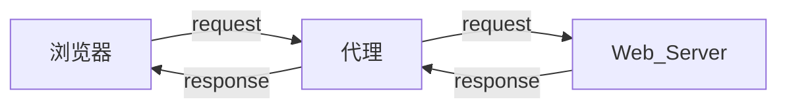

# requests模块发送get请求
通过requests向百度首页发送请求，获取该页面的源码  
```python 
import requests

# 目标url
url = "https://www.baidu.com"

# 向目标发送get请求
reponse = requests.get(url)

# 打印响应内容
print(reponse.text)
```

## requests模块发送请求
### 发送带header的请求
利用 `requestes.get(url)` 爬取到的内容会比使用浏览器爬取到的内容少很多，因为少了**请求头**的信息

#### 携带请求头发送请求的方法
**resquests.get(url,headers=headers)**  
+ headers参数接收字典形式的请求头
+ 请求头字段名作为key，字段对应的值作为value


```
import requests
# 目标url
url = 'https://www.baidu.com'

headers = {User-Agent: Mozilla/5.0 (X11; Linux x86_64; rv:92.0) Gecko/20100101 Firefox/92.0}

# 向目标url发送get请求
response = requests.get(url)

# 打印相应的内容
print(reponse.content.decode())
```

### 发送带参数的请求
#### 在url中携带参数
直接对含有参数的url发起请求，例如

`url = 'https://www.baidu.com/s?wd=python'`

#### 通过params携带参数字典
1. 构建请求参数字典
2. 想接口发送请求时带上参数字典，参数字典设置给 `params`

```python
import requests
# 目标url

headers = {'User-Agent': 'Mozilla/5.0 (X11; Linux x86_64; rv:92.0) Gecko/20100101 Firefox/92.0'}

url = 'https://www.baidu.com/s?wd=python'

# 参数字典
kw = {'wd':'python'}

# 向目标url发送get请求
response = requests.get(url,headers = headers,params=kw )
```

### 在herders参数中携带cookies
网站经常利用请求头中的Cookie字段来做用户访问状态的保持，可以在headers参数中添加Cookie，模拟普通用户的请求  

#### 完成代码
+ 从浏览器中复制 User-Agent和Cookie
+ 浏览器中的请求头字段和值与headers参数中必须一直
+ headers请求参数字典中的Cookie键对应的值是字符串

### cookies参数的使用
#### cookies的参数的形式：字典
```python
cookies = {"cookie的name":"cookie的value"}
```
+ 该字典对应请求头中的Coookies字符串，以分号、空格分割每一对字典键值对
+ 等号左边对应的是一个cookie的name，对应cookies字典的key
+ 等号右边对应cookies字典的value

#### cookies参数的使用方法
```python
response = requests.get(url,cookies)
```
#### 将cookie字符串转化为cookies参数所需的字典：
```python
cookies_dict = {
	cookie.split('-')[0]:cookie.split('-')[-1] for cookie in cookies_str.split(';')
}
```

#### 使用注意
cookie一般有过期时间，一旦过期，需要重新获取

### cookieJar对象转化为cookies字典方法
使用 `request` 获取的 `response` 对象，具有 cookies 属性，该属性是一个 cookieJar 类型，包含了对方服务器设置在本地的cookie

#### 转换方法
cookies_dict = resquests.util.dict_from_cookiejar(response.cookies)
+ 其中response.cookies返回的就是 cookieJar 类型的对象
+ requests.until.dict_from_cookiejar 函数返回cookie字典


### 超时参数timeout的使用
在爬虫中如果一个请求长时间没有结果，会很拖延项目的效率，这个时候就可以设置一个超时参数
#### 设置超时参数
```python
response = requests.get(url,timeout=3)
```
+ timeout = 3 表示发送请求后3秒钟内返回响应，否则就跑出异常


### 代理的使用
#### 理解使用代理的过程
+ 代理IP是一个ip，执行的是一个代理服务器
+ 代理服务器能够帮助我们想目标服务器发送请求



#### 正向代理和反向代理
从发送请求的一方的角度，来区分正向或者反向代理
+ 为浏览器或者客户端转发请求，叫做正向代理
	+ 浏览器知道最终处理请求的服务器的真实ip地址，例如vpn
+ 不为浏览器或者客户端转发请求，而是为最终处理请求的服务器转发请求的，叫做反向代理
	+ 浏览器不知道服务器的真实地址，例如nginx

#### 代理ip(代理服务器)的分类
**根据代理ip的匿名程度，代理ip可以分为下面三类**  
+ 透明代理：透明代理虽然可以隐藏用户的ip地址，但是还是可以查到是谁在使用，目标服务器接收到的请求头如下：
	+ REMOTE_ADDR = Proxy IP
	+ HTTP_VIA = Proxy IP
	+ HTTP_X_FORWARDED_FOR = Your IP

+ 匿名代理：使用匿名代理，别人只知道用户使用了代理，无法知道用户是谁，服务器接收到的请求头如下：
	+ REMOTE_ADDR = proxy IP
	+ HTTP_VIA = proxy IP
	+ HTTP_X_FORWARDED_FOR = proxy IP

+ 高匿代理：让别人无法发现是否在使用代理，是最好的选择，目标服务器说到的请求头如下：
	+ REMOTE_ADDR = proxy IP
	+ HTTP_VIA = not determined
	+ HTTP_X_FORWARDED_FOR = not determined

**根据网站所使用的协议不同，需要使用响应协议的代理服务，从代理服务使用的协议可以分为：**
+ http代理：目标url为http协议
+ https代理：目标url为https协议
+ socks隧道代理(例如socks5代理)等：
	+ socks 代理只是简单的传送数据包，不关心是哪种协议
	+ socks 代理比https、http代理耗时少
	+ socks 代理可以转发http和https的请求

#### requests代理参数的设置
为了让服务器以为不是同一个客户端在请求，为了防止频繁向一个域名发送请求被封ip，所以需要使用代理ip  

**用法**  
```python
response = requests.get(url, proxies=proxies)
```
+ prixies的形式：字典

例如：
```python
proxies = {
	"http":"http://xxx.xxx.xx.xx:xxx",
	"https":"https://xxx.xxx.xx.xx:xxx"
}
```

如果proxies字典包含多个键值对，发送请求时将按照url地址的协议来选择相应的代理  

### verify 参数忽略CA证书
添加参数 `verify=False`
